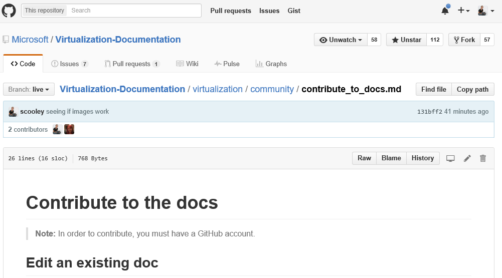

# 문서 작성에 참여

> **참고:**  문서 작성에 참여하려면 [GitHub](https://www.github.com) 계정이 있어야 합니다.

## 기존 문서 편집

1. 편집할 문서를 찾습니다.  

2. **Contribute to this topic**(이 문서 작성에 참여)을 선택합니다.  
  
  
  그러면 이 파일과 연관된 GitHub의 마크다운 파일에 자동으로 리디렉션됩니다.
  
  GitHub에 로그인되어 있어야 합니다.  그렇지 않은 경우에는 로그인하거나 GitHub 계정을 만듭니다.
  
  
  
3. 편집 아이콘을 선택하여 브라우저 내 편집기로 편집합니다.
  
  

4. 변경 내용을 인라인으로 적용합니다.
  
  가능한 작업:
  1. 파일 편집
  2. 변경 미리 보기
  3. 파일 이름 바꾸기(이 작업을 수행할 가능성 낮음)
  
  
  
5. 변경 내용을 끌어오기 요청으로 제안합니다.
  
  

6. 변경 내용 검토
  
  **끌어오기 요청에서 살펴볼 내용**  
  * 변경 내용이 맞습니다. 즉, 기술을 정확하게 표현합니다.
  * 맞춤법/문법이 올바릅니다.
  * 문서의 논리적 위치
    
  

7. [끌어오기 요청](contribute-to-docs.md#pull-requests) 만들기  

## 끌어오기 요청

대부분의 변경 내용은 끌어오기 요청을 통해 커밋됩니다.  끌어오기 요청은 다수의 검토자가 변경 집합을 검토하고, 변경하고, 현재 콘텐츠에 메모를 추가하는 방식입니다.


## 리포지토리를 분기하고 로컬에서 편집

장기 문서 작업의 경우 리포지토리를 로컬로 복제하고 컴퓨터에서 작업합니다.

다음 가이드에서는 내(Sarah Cooley) 설정을 에뮬레이트하는 방법을 보여 줍니다.  동일하게 제대로 작동하는 여러 가지 대체 설정이 있습니다.

> **참고:** 모든 doc 도구는 Linux/OSX에서도 동일하게 제대로 작동합니다.  다른 가이드를 원하는 경우 요청하세요.

다음과 같은 세 섹션으로 구분됩니다.
* [Git 설정](contribute-to-docs.md#set-up-git)
  * git 설치
  * 초기 설정
  * 설명서 리포지토리 분기
  * 복사본을 로컬 컴퓨터에 복제
* [초기 자격 증명 관리](contribute-to-docs.md#validate-and-stash-credentials)
  * 자격 증명 및 자격 증명 도우미 스태시에 대한 정보
* [문서 환경 설정](contribute-to-docs.md#set-up-markdown-editing-environment)
  * VSCode 설치
  * 몇 가지 유용한 기능을 안내하는 Git용 VSCode
  * 첫 번째 커밋 수행

### Git 설정

1. [여기](https://git-for-windows.github.io/)에서 Windows에 git 설치

  설치에서 하나의 값만 변경해야 합니다.

  **PATH 환경 조정** Windows 명령 프롬프트에서 Git 사용

  

  따라서 PowerShell 콘솔/Windows 콘솔에서 git 명령을 사용할 수 있습니다.

2. Git ID 구성

  PowerShell 창을 열고 다음을 실행합니다.

  ``` PowerShell
  git config --global user.name "User Name"
  git config --global user.email username@microsoft.com
  ```

  Git은 이러한 값을 사용하여 커밋에 레이블을 지정합니다.

  > 다음 오류가 수신되는 경우 git이 제대로 설치되지 않았거나 PowerShell을 다시 시작해야 합니다.
    ``` PowerShell
    git : The term 'git' is not recognized as the name of a cmdlet, function, script file, or operable program. Check the spelling of the name, or if a path was included, verify that the path is correct and try again.
    ```

3. Git 환경 구성

   최소한 이 컴퓨터에서는 사용자 이름 및 암호를 한 번만 입력해도 되도록 자격 증명 도우미를 설치합니다.
   이 기본 [Windows 자격 증명 도우미](https://github.com/Microsoft/Git-Credential-Manager-for-Windows#download-and-install)를 사용합니다.

   설치되면 다음을 실행하여 자격 증명 도우미를 사용하도록 설정하고 푸시 동작을 설정합니다.
   ```
   git config --global credential.helper manager
   git config --global push.default simple
   ```

   처음으로 GitHub를 인증하면 사용자 이름과 2단계 authcode(사용하도록 설정한 경우)를 입력하라는 메시지가 표시됩니다.
   예:
   ```
   C:\Users\plang\Source\Repos\Virtualization-Documentation [master]> git pull
   Please enter your GitHub credentials for https://github.com/
   username: plang@microsoft.com
   password:
   authcode (app): 562689
   ```
   그러면 GitHub에 대한 올바른 사용 권한으로 [개인용 액세스 토큰](https://github.com/settings/tokens)을 자동으로 만든 다음 해당 토큰을 로컬 컴퓨터에 안전하게 저장합니다. 나중에는 메시지가 다시 표시되지 않습니다.

4. 리포지토리 분기

5. 리포지토리 복제

  Git clone은 적절한 후크로 git 리포지토리의 로컬 복사본을 만들어 동일한 리포지토리의 다른 복제본과 동기화합니다.

  기본적으로 복제 과정에서 현재 디렉터리의 리포지토리와 동일한 이름의 폴더가 만들어집니다.  모든 내 git 리포지토리를 내 사용자 디렉터리에 유지합니다.  [여기](http://git-scm.com/docs/git-clone)에서 git clone에 대해 자세히 알아보세요.

  ``` PowerShell
  cd ~
  git clone https://github.com/Microsoft/Virtualization-Documentation.git
  ```

  성공하면 `Virtualization-Documentation` 폴더가 생깁니다.

  ``` PowerShell
  cd Virtualization-Documentation
  ```

5. [옵션] Posh-Git 설정

  Posh-Git은 PowerShell에서 Git 사용을 좀더 친숙하게 만드는 PowerShell 모듈을 만든 커뮤니티입니다.  Posh-Git은 PowerShell에서 Git에 대해 탭 완성 기능을 추가하고 분기 및 파일 상태에 대한 프롬프트 표시를 유용하게 만들 수도 있습니다.  [여기](https://github.com/dahlbyk/posh-git)에서 자세히 알아보세요.  관리자 PowerShell 콘솔에서 다음을 실행하여 Posh-Git을 설치할 수 있습니다.

  ``` PowerShell
  Install-Module -Name posh-git
  ```

  PowerShell을 시작할 때마다 Posh-Git가 자동으로 작동하도록 하려면 PowerShell 프로필(예: `%UserProfile%\My Documents\WindowsPowerShell\profile.ps1 `)에 다음 코드를 추가합니다.

  ``` PowerShell
  Import-Module posh-git

  function global:prompt {
    $realLASTEXITCODE = $LASTEXITCODE

    Write-Host($pwd.ProviderPath) -nonewline

    Write-VcsStatus

    $global:LASTEXITCODE = $realLASTEXITCODE
    return "> "
  }
  ```

### 자격 증명 유효성 검사 및 스태시

  리포지토리가 올바르게 설정되었는지 확인하려면 새 콘텐츠 끌어오기를 시도하세요.

  ``` PowerShell
  git pull
  ```


### markdown 편집 환경 설정

1. VSCode를 다운로드합니다.

6. 테스트 커밋을 수행합니다.  자격 증명이 올바르게 스태시된 경우 모두 완벽하게 작동해야 합니다.


