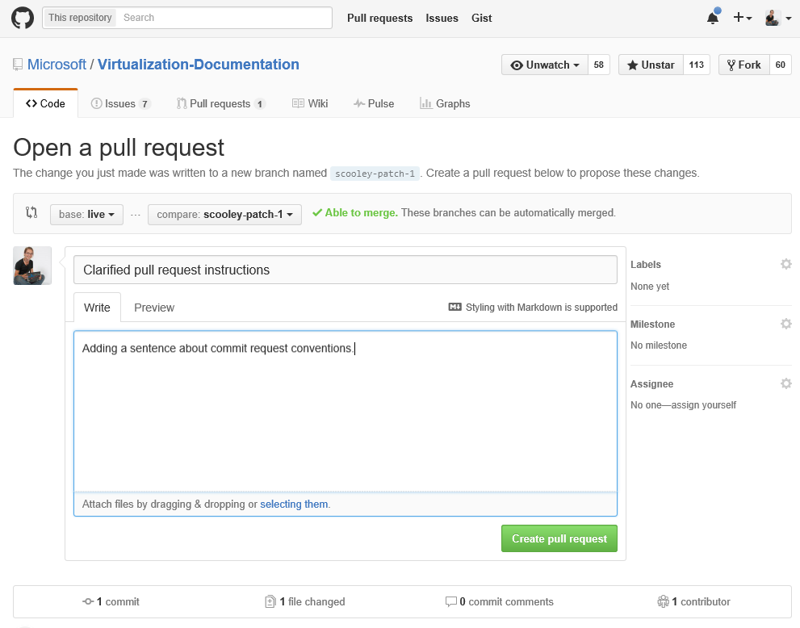

# 문서 작성에 참여

> **참고:**  문서 작성에 참여하려면 [GitHub](https://www.github.com) 계정이 필요합니다.

## 기존 문서 편집

1. 편집할 문서를 찾습니다.

2. **Contribute to this topic**(이 문서 작성에 참여)를 선택합니다.  
    

    그러면 이 파일과 연관된 GitHub의 마크다운 파일에 자동으로 리디렉션됩니다.

    GitHub에 로그인되어 있어야 합니다. 그렇지 않은 경우에는 로그인하거나 GitHub 계정을 만듭니다.

    

3. 편집 아이콘을 선택하여 브라우저 내 편집기로 편집합니다.

    

4. 변경 내용을 인라인으로 적용합니다.

    가능한 작업:
    1. 파일 편집
    2. 변경 미리 보기
    3. 파일 이름 바꾸기(이 작업을 수행할 가능성 낮음)

    

5. 변경 내용을 끌어오기 요청으로 제안합니다.

    

6. 변경 내용 검토

    **끌어오기 요청에서 살펴볼 내용**
    * 변경 내용이 맞습니다. 즉, 기술을 정확하게 표현합니다.
    * 맞춤법/문법이 올바릅니다.
    * 문서의 논리적 위치

    

7. [끌어오기 요청](contribute_to_docs.md#pull-requests) 만들기

## 끌어오기 요청

대부분의 변경 내용은 끌어오기 요청을 통해 커밋됩니다. 끌어오기 요청은 다수의 검토자가 변경 집합을 검토하고, 변경하고, 현재 콘텐츠에 메모를 추가하는 방식입니다.

