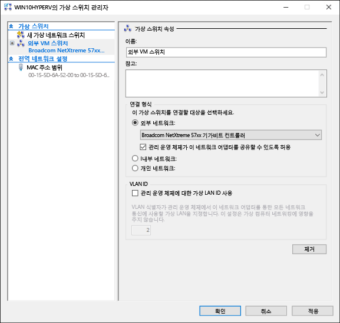
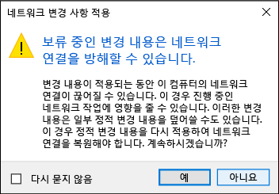

# <a name="create-a-virtual-network"></a>가상 네트워크 만들기

가상 컴퓨터는 컴퓨터와 네트워크를 공유할 가상 네트워크가 필요합니다.  가상 네트워크 만들기는 선택적입니다. 가상 컴퓨터를 인터넷이나 네트워크에 연결할 필요가 없다면 [Windows 가상 컴퓨터 만들기](create-virtual-machine.md)로 건너뛰세요.


## <a name="connect-virtual-machines-to-the-internet"></a>가상 컴퓨터를 인터넷에 연결

Hyper-V에는 외부, 내부, 개인의 세 가지 가상 스위치 유형이 있습니다. 컴퓨터의 네트워크를 여기에서 실행 중인 가상 컴퓨터와 공유하려면 외부 스위치를 만듭니다.

이 연습은 외부 가상 스위치를 만드는 과정을 안내합니다. 완료되면 Hyper-V 호스트가 가상 컴퓨터를 컴퓨터의 네트워크 연결을 통해 인터넷에 연결할 수 있는 가상 스위치를 가지게 됩니다. 

### <a name="create-a-virtual-switch-with-hyper-v-manager"></a>Hyper-V 관리자를 사용하여 가상 스위치 만들기

1. Hyper-V 관리자를 엽니다.  이를 빠르게 하는 방법은 Windows 단추나 키를 누르고 "Hyper-V Manager"를 입력하는 것입니다.  
검색으로 Hyper-V 관리자를 찾을 수 없다면 Hyper-V 또는 Hyper-V 관리 도구를 사용하지 않도록 설정한 것입니다.  [Hyper-V를 사용하도록 설정](enable-hyper-v.md)하기 위한 지침을 참조하십시오.

2. 왼쪽 창에서 서버를 선택하거나 오른쪽 창에서 "서버에 연결..."을 클릭합니다.

3. Hyper-V 관리자의 오른쪽 '작업' 메뉴에서 **가상 스위치 관리자...** 를 선택합니다. 

4. '가상 스위치' 섹션 아래에서 **새 가상 네트워크 스위치**를 선택합니다.

5. '만들려는 가상 스위치 유형을 선택하세요.'에서 **외부**를 선택합니다.

6. **가상 스위치 만들기** 단추를 선택합니다.

7. '가상 스위치 속성'에서 새 스위치에 **외부 VM 스위치** 같은 이름을 지정합니다.

8. '연결 형식'에서 **외부 네트워크**가 선택되었는지 확인합니다.

9. 새 가상 스위치와 연결할 실제 네트워크 카드를 선택합니다. 이 네트워크 카드는 네트워크에 물리적으로 연결되어 있습니다.  

    

10. **적용**을 선택하여 가상 스위치를 만듭니다. 이때 다음과 같은 메시지가 표시될 가능성이 높습니다. **예**를 클릭하여 계속합니다.

      

11. **확인**을 선택하여 가상 스위치 관리자 창을 닫습니다.


### <a name="create-a-virtual-switch-with-powershell"></a>PowerShell을 사용하여 가상 스위치 만들기

다음 단계는 PowerShell을 사용하여 외부 연결로 가상 스위치를 만드는 데 사용할 수 있습니다. 

1. **Get-NetAdapter**를 사용하여 Windows 10 시스템에 연결된 네트워크 어댑터의 목록을 반환합니다.

    ```powershell
    PS C:\> Get-NetAdapter

    Name                      InterfaceDescription                    ifIndex Status       MacAddress             LinkSpeed
    ----                      --------------------                    ------- ------       ----------             ---------
    Ethernet 2                Broadcom NetXtreme 57xx Gigabit Cont...       5 Up           BC-30-5B-A8-C1-7F         1 Gbps
    Ethernet                  Intel(R) PRO/100 M Desktop Adapter            3 Up           00-0E-0C-A8-DC-31        10 Mbps  
    ```

2. Hyper-V 스위치와 함께 사용할 네트워크 어댑터를 선택하고 **$net**이라는 변수에 인스턴스를 배치합니다.

    ```
    $net = Get-NetAdapter -Name 'Ethernet'
    ```

3. 다음 명령을 실행하여 새 Hyper-V 가상 스위치를 만듭니다.

    ```
    New-VMSwitch -Name "External VM Switch" -AllowManagementOS $True -NetAdapterName $net.Name
    ```

## <a name="virtual-networking-on-a-laptop"></a>노트북에서 가상 네트워킹

### <a name="nat-networking"></a>NAT 네트워킹
NAT(네트워크 주소 변환)를 사용하면 내부 Hyper-V 가상 스위치를 통해 호스트 컴퓨터의 IP 주소를 포트와 조합하여 가상 컴퓨터에서 컴퓨터의 네트워크에 액세스할 수 있습니다.

이는 몇 가지 유용한 속성을 가지고 있습니다.
1. NAT는 외부 IP 주소와 포트를 더 많은 내부 IP 주소 집합에 매핑하여 IP 주소를 절약합니다. 
2. NAT를 사용하면 여러 가상 컴퓨터에서 동일한(내부) 통신 포트가 필요한 응용 프로그램을 고유한 외부 포트에 매핑하여 호스트할 수 있습니다.
3. NAT는 내부 스위치를 사용합니다. 내부 스위치를 만드는 것은 네트워크 연결 사용을 유발하지 않으므로 컴퓨터의 네트워킹에 대한 방해가 적습니다.

NAT 네트워크를 설정하고 가상 컴퓨터에 연결하려면 [NAT 네트워킹 사용자 가이드](../user-guide/setup-nat-network.md)를 따르십시오.

### <a name="the-two-switch-approach"></a>두 스위치 접근 방식
노트북에서 Windows 10 Hyper-V를 실행 중이고 무선 네트워킹과 유선 네트워크 사이를 자주 전환한다면 이더넷과 무선 네트워크 카드 모두를 위한 가상 스위치를 만들고자 할 수 있습니다. 이 구성을 사용하면 노트북이 네트워크에 연결된 방법에 따라 이러한 스위치 간에 가상 컴퓨터를 변경할 수 있습니다. 가상 컴퓨터는 유선 및 무선 간에 자동으로 전환되지 않습니다.
>참고: 무선 네트워크 카드의 외부 가상 스위치를 구성하는 것은 지원되지 않으며 테스트 목적으로만 사용해야 합니다.  


## <a name="next-step---create-a-virtual-machine"></a>다음 단계 - 가상 컴퓨터 만들기
[Windows 가상 컴퓨터 만들기](create-virtual-machine.md)
