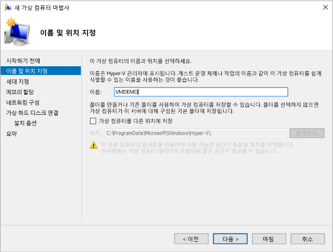
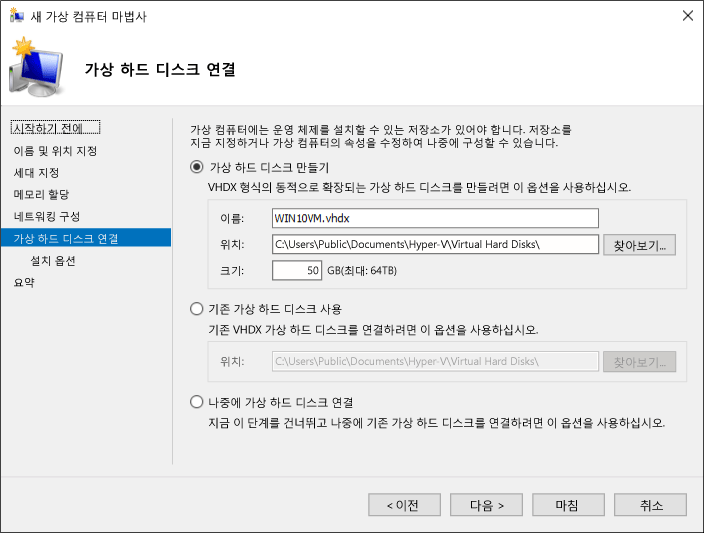

# <a name="create-virtual-machine-with-hyper-v-on-windows-10"></a>Windows 10에서 Hyper-V를 사용하여 가상 컴퓨터 만들기

가상 컴퓨터를 만들고 새 가상 컴퓨터에 운영 체제를 설치하는 방법을 알아보세요.  실행하려는 운영 체제의 .iso 파일이 필요합니다. 필요한 경우 [TechNet Evaluation Center](http://www.microsoft.com/evalcenter/)에서 Windows 10 평가판을 가져옵니다.

## <a name="create-a-virtual-machine-with-hyper-v-manager"></a>Hyper-V 관리자를 사용하여 가상 컴퓨터 만들기

1. Window 키를 누르고 "Hyper-V 관리자"를 입력하거나 응용 프로그램에서 **Hyper-V 관리자**를 검색하여 Hyper-V 관리자를 엽니다.

1. Hyper-V 관리자에서 **작업** > **새로 만들기** > **가상 컴퓨터**를 클릭하여 새 가상 컴퓨터 마법사를 표시합니다.

1. '시작하기 전에' 콘텐츠를 검토하고 **다음**을 클릭합니다.

1. 가상 컴퓨터에 이름을 지정합니다.
  > **참고:** 가상 컴퓨터 내부에 배포될 게스트 운영 체제에 지정되는 컴퓨터 이름이 아니라 Hyper-V에서 가상 컴퓨터에 사용하는 이름입니다.

1. **c:\virtualmachine**과 같이 가상 컴퓨터 파일이 저장될 위치를 선택합니다. 기본 위치를 적용할 수도 있습니다. 작업이 끝나면 **다음**을 클릭합니다.
    
  

1. 컴퓨터에 대해 생성을 선택하고 **다음**을 클릭합니다.  

  2세대 가상 컴퓨터는 Windows Server 2012 R2에서 도입되었고 간소화된 가상 하드웨어 모델 및 일부 추가 기능을 제공합니다. 2세대 가상 컴퓨터에는 64비트 운영 체제만 설치할 수 있습니다. 2세대 가상 컴퓨터에 대한 자세한 내용은 [Generation 2 Virtual Machine Overview(2세대 가상 컴퓨터 개요)](<https://docs.microsoft.com/previous-versions/windows/it-pro/windows-server-2012-R2-and-2012/dn282285(v=ws.11)>)를 참조하세요.
  
  > 새 가상 컴퓨터가 2세대로 구성되고 Linux 배포를 실행할 경우 보안 부팅을 사용하지 않도록 설정해야 합니다. 보안 부팅에 대한 자세한 내용은 [Secure Boot(보안 부팅)](<https://docs.microsoft.com/previous-versions/windows/it-pro/windows-8.1-and-8/dn486875(v=ws.11)>)을 참조하세요.

2. **시작 메모리** 값으로 **2048**MB를 선택하고 **동적 메모리 사용**을 선택된 상태로 유지합니다. **다음** 단추를 클릭합니다.

  메모리는 Hyper-V 호스트 및 호스트에서 실행 중인 가상 컴퓨터 간에 공유됩니다. 단일 호스트에서 실행할 수 있는 가상 컴퓨터의 수는 사용 가능한 메모리에 따라 부분적으로 달라집니다. 동적 메모리를 사용하도록 가상 컴퓨터를 구성할 수 있습니다. 활성화하는 경우 동적 메모리는 실행 중인 가상 컴퓨터에서 사용되지 않은 메모리를 회수 합니다. 이렇게 하면 호스트에서 더 많은 가상 컴퓨터를 실행할 수 있습니다. 동적 메모리에 대한 자세한 내용은 [Hyper-V Dynamic Memory Overview(Hyper-V 동적 메모리 개요)](https://docs.microsoft.com/previous-versions/windows/it-pro/windows-server-2012-R2-and-2012/hh831766(v=ws.11))를 참조하세요.

3. 네트워킹 구성 마법사에서 가상 컴퓨터에 대한 가상 스위치를 선택하고 **다음**을 클릭합니다. 자세한 내용은 [가상 스위치 만들기](connect-to-network.md)를 참조하세요.

4. 가상 하드 드라이브에 이름을 지정하고 위치를 선택하거나 기본값을 유지하고 마지막으로 크기를 지정합니다. 준비되면 **다음**을 클릭합니다.

  가상 하드 드라이브는 가상 컴퓨터에 대해 실제 하드 드라이브와 유사한 저장소를 제공합니다. 가상 컴퓨터에 운영 체제를 설치하기 위해 가상 하드 드라이브가 필요합니다.
  
  

1. 설치 옵션 마법사에서 **부팅 이미지 파일에서 운영 체제 설치**를 선택한 다음 운영 체제 .iso 파일을 선택합니다. 완료되면 **다음**을 클릭합니다.

  가상 컴퓨터를 만들 때 일부 운영 체제 설치 옵션을 구성할 수 있습니다. 다음 세 가지 옵션을 사용할 수 있습니다.

  * **나중에 운영 체제 설치** – 이 옵션을 선택하면 가상 컴퓨터를 추가로 수정하지 않습니다.

  * **부팅 가능 이미지 파일에서 운영 체제 설치** – 물리적 컴퓨터의 실제 CD-ROM 드라이브에 CD를 삽입하는 것과 비슷합니다. 이 옵션을 구성하려면 .iso 이미지를 선택합니다. 이 이미지는 가상 컴퓨터의 가상 CD-ROM 드라이브에 탑재됩니다. 가상 컴퓨터의 부팅 순서는 CD-ROM 드라이브에서 먼저 부팅되도록 변경됩니다.

  * **네트워크 기반 설치 서버에서 운영 체제 설치** – 이 옵션은 네트워크 스위치에 가상 컴퓨터를 연결하지 않는 한 사용할 수 없습니다. 이 구성에서 가상 컴퓨터는 네트워크에서 부팅하려고 합니다.

1. 가상 컴퓨터 세부 정보를 검토하고 **마침**을 클릭하여 가상 컴퓨터 만들기를 완료합니다.

## <a name="create-a-virtual-machine-with-powershell"></a>PowerShell을 사용하여 가상 컴퓨터 만들기

1. 관리자 권한으로 PowerShell ISE를 엽니다.

2. 다음 스크립트를 실행합니다.

  ``` powershell
  # Set VM Name, Switch Name, and Installation Media Path.
  $VMName = 'TESTVM'
  $Switch = 'External VM Switch'
  $InstallMedia = 'C:\Users\Administrator\Desktop\en_windows_10_enterprise_x64_dvd_6851151.iso'

  # Create New Virtual Machine
  New-VM -Name $VMName -MemoryStartupBytes 2147483648 -Generation 2 -NewVHDPath "D:\Virtual Machines\$VMName\$VMName.vhdx" -NewVHDSizeBytes 53687091200 -Path "D:\Virtual Machines\$VMName" -SwitchName $Switch

  # Add DVD Drive to Virtual Machine
  Add-VMScsiController -VMName $VMName
  Add-VMDvdDrive -VMName $VMName -ControllerNumber 1 -ControllerLocation 0 -Path $InstallMedia

  # Mount Installation Media
  $DVDDrive = Get-VMDvdDrive -VMName $VMName

  # Configure Virtual Machine to Boot from DVD
  Set-VMFirmware -VMName $VMName -FirstBootDevice $DVDDrive
  ```

## <a name="complete-the-operating-system-deployment"></a>운영 체제 배포 완료

가상 컴퓨터 빌드를 완료하려면 가상 컴퓨터를 시작하고 운영 체제 설치를 진행해야 합니다.

1. Hyper-V 관리자에서 가상 컴퓨터를 두 번 클릭합니다. 그러면 VMConnect 도구가 시작됩니다.

2. VMConnect에서 녹색 시작 단추를 클릭합니다. 이는 실제 컴퓨터에서 전원 단추를 누르는 것과 같습니다. 'CD 또는 DVD에서 부팅하려면 아무 키나 누르십시오.'라는 메시지가 표시되면 아무 키나 눌러 진행합니다.

  > **참고:** 키 입력이 가상 컴퓨터로 전송되도록 하려면 VMConnect 창 내부를 클릭해야 할 수 있습니다.

3. 가상 컴퓨터가 설치를 부팅하고 물리적 컴퓨터에서와 마찬가지로 설치를 진행할 수 있습니다.

   

  > **참고:** 볼륨 라이선스 버전의 Windows를 실행 중이 아닌 경우 가상 컴퓨터 내에서 실행 중인 Windows에 대한 별도 라이선스가 필요합니다. 가상 컴퓨터의 운영 체제는 별개의 호스트 운영 체제입니다.
