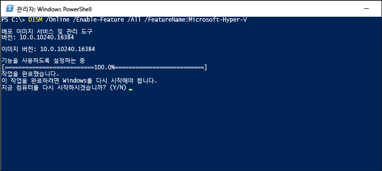
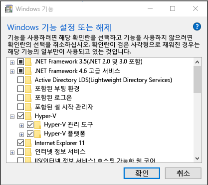
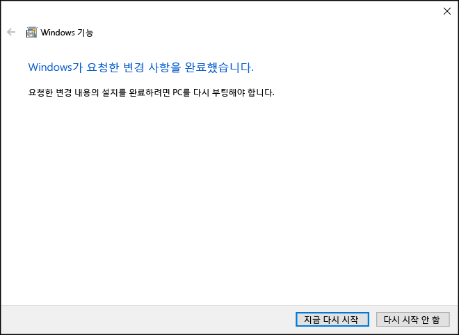

# Windows 10에 Hyper-V 설치

Windows 10에서 가상 컴퓨터를 만들 수 있도록 Hyper-V를 사용하도록 설정합니다.  
Windows 10 제어판, PowerShell(즐겨 사용하는 방식)을 사용하거나 배포 이미지 서비스 및 관리(DISM) 도구를 사용하는 방법을 포함하여 Hyper-V는 여러 방식으로 사용하도록 설정할 수 있습니다. 이 문서에서는 각 옵션을 안내합니다.

> **참고:**  Hyper-V는 선택적 기능으로 Windows에서 기본 제공됩니다. Hyper-V 다운로드나 설치 가능한 구성 요소는 없습니다. 

## 요구 사항 확인

* Windows 10 Enterprise, Professional 또는 Education
* 두 번째 수준 주소 변환(SLAT)을 사용하는 64비트 프로세서.
* VM 모니터 모드 확장(Intel CPU의 VT-c)을 지원하는 CPU.
* 최소 4GB의 메모리.

Hyper-V 역할은 Windows 10 Home에는 **설치할 수 없습니다**.  
**설정** > **업데이트 및 보안** > **정품 인증**을 열어 Windows 10 Home 버전에서 Windows 10 Professional로 업그레이드합니다.

자세한 내용과 문제 해결은 [Windows 10 Hyper-V 시스템 요구 사항](../reference/hyper-v-requirements.md)을 참조하세요.


## Hyper-V 설치 
Hyper-V는 선택적 기능으로 Windows에서 기본 제공됩니다. Hyper-V 다운로드나 설치 가능한 구성 요소는 없습니다.  기본 제공 Hyper-V 역할을 사용하도록 설정하는 데는 여러 방법이 있습니다.

### PowerShell을 사용하여 Hyper-V를 사용하도록 설정

1. 관리자 권한으로 PowerShell 콘솔을 엽니다.

2. 다음 명령을 실행합니다.
  ```powershell
  Enable-WindowsOptionalFeature -Online -FeatureName Microsoft-Hyper-V -All
  ```  

  명령을 찾을 수 없을 경우 관리자 권한으로 PowerShell을 실행하고 있는지 확인합니다.  

설치가 완료되면 컴퓨터를 다시 부팅해야 합니다.  

### CMD와 DISM을 사용하여 Hyper-V를 사용하도록 설정

DISM(배포 이미지 서비스 및 관리) 도구를 사용하면 Windows와 Windows 이미지를 구성하는 데 도움이 됩니다.  DISM은 많은 응용 프로그램을 갖추고 있으며, 운영 체제가 실행 중인 동안 Windows 기능을 사용하도록 설정할 수 있습니다.  

DISM을 사용하여 Hyper-V 역할을 활성화하려면:
1. 관리자 권한으로 PowerShell 또는 CMD 세션을 엽니다.

2. 다음 명령을 입력합니다.  
  ```powershell
  DISM /Online /Enable-Feature /All /FeatureName:Microsoft-Hyper-V
  ```  
  

DISM에 대한 자세한 내용은 [DISM 기술 참조](https://technet.microsoft.com/en-us/library/hh824821.aspx)를 참조하세요.

### Hyper-V 역할을 사용하도록 수동으로 설정

1. Windows 단추를 마우스 오른쪽 단추로 클릭하고 '프로그램 및 기능'을 선택합니다.

2. **Windows 기능 사용/사용 안 함**을 선택합니다.

3. **Hyper-V**를 선택하고 **확인**을 클릭합니다.  



설치가 완료되면 컴퓨터를 다시 시작하라는 메시지가 표시됩니다.




## 다음 단계 - 네트워크 설정
[인터넷에 연결](connect-to-network.md)

