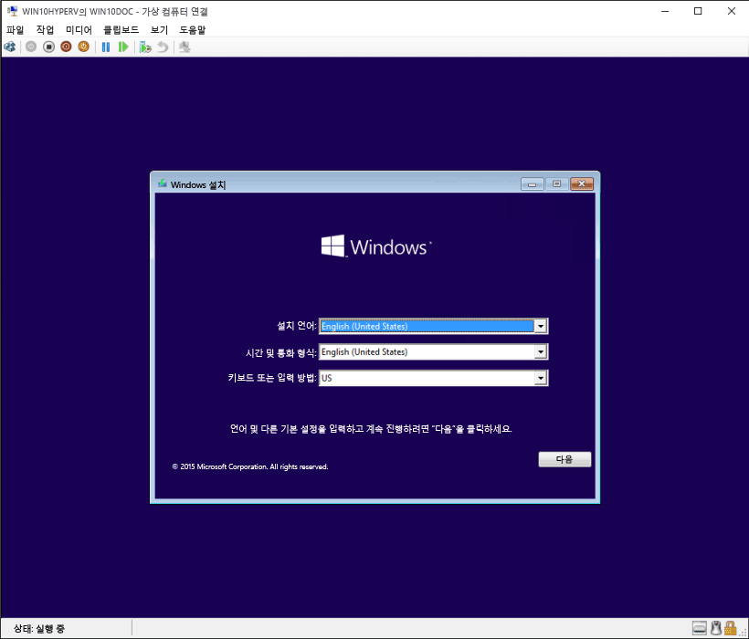

# Hyper-V를 사용하여 가상 컴퓨터 만들기

가상 컴퓨터를 만들고 운영 체제를 설치합니다.

가상 컴퓨터를 생성하기 위한 새로운 도구를 개발해오면서 지난 3개의 릴리스에서 지침이 상당 부분 변경되었습니다.

올바른 명령 집합을 위한 운영 체제를 선택하세요.

* [Windows 10 Fall Creators Update 이상](quick-create-virtual-machine.md#windows-10-fall-creators-update)
* [Windows 10 크리에이터스 업데이트](quick-create-virtual-machine.md#windows-10-creators-update)
* [Windows 10 1주년 업데이트 이하](quick-create-virtual-machine.md#before-windows-10-creators-update)

그럼 시작해 보겠습니다.

## Windows 10 Fall Creators Update

가을 크리에이터스 업데이트에서는 Hyper-V 관리자와 독립적으로 실행할 수 있는 가상 컴퓨터 갤러리를 포함하도록 빨리 만들기 기능이 확장되었습니다.

가을 크리에이터스 업데이트에서 가상 컴퓨터를 새로 만들려면

1. 시작 메뉴에서 Hyper-V 빨리 만들기를 엽니다.

    

1. 운영 체제를 선택하거나 로컬 설치 원본을 사용하여 자체 운영 체제를 선택합니다.

    

    1. 자체 이미지를 사용하여 가상 컴퓨터를 만들고 싶으면 **로컬 설치 원본** 선택합니다.
    1. **설치 원본 변경**을 선택합니다.
      
    1. 새 가상 컴퓨터로 전환하고 싶은 .iso 또는 .vhdx를 선택합니다.
    1. 이미지가 Linux 이미지인 경우 보안 부팅 옵션을 선택 취소합니다.
      

1. "가상 컴퓨터 만들기"를 선택

이제 되었습니다.  나머지 작업은 빨리 만들기가 처리합니다.

## Windows 10 크리에이터스 업데이트

1. 시작 메뉴에서 Hyper-V 관리자를 엽니다.

1. Hyper-V 관리자의 오른쪽에 있는 **작업** 메뉴에서 **빨리 만들기**를 찾습니다.

1. 가상 컴퓨터를 사용자 지정합니다.

    * (선택 사항) 가상 컴퓨터 이름을 지정합니다.
    * 가상 컴퓨터를 설치할 미디어를 선택합니다. .iso 또는 .vhdx 파일로 설치할 수 있습니다.
    가상 컴퓨터에서 Windows를 설치하는 경우 Windows 보안 부팅을 사용할 수 있습니다. 그렇지 않으면 선택되지 않은 상태로 둡니다.
    * 네트워크를 설정합니다.
    기존 가상 스위치가 있는 경우 네트워크 드롭다운 목록에서 선택할 수 있습니다. 기존 스위치가 없는 경우에는 자동 네트워크를 설정하는 단추가 보일 것입니다. 이 단추는 가상 네트워크를 자동으로 구성합니다.

1. **연결**을 클릭하여 가상 컴퓨터를 시작합니다. 설정 편집에 대해 걱정할 필요가 없습니다. 언제든지 돌아가서 변경할 수 있습니다.

    'CD 또는 DVD에서 부팅하려면 아무 키나 누르십시오.'라는 메시지가 표시되면 아무 키나 눌러 진행합니다.  가상 컴퓨터는 사용자가 CD로 설치하는 것으로 인식합니다.

축하합니다. 새 가상 컴퓨터가 생겼습니다.  이제 운영 체제를 설치할 준비가 완료되었습니다.

가상 컴퓨터가 다음과 같이 보일 것입니다.

> **참고:** 볼륨 라이선스 버전의 Windows를 실행 중이 아닌 경우 가상 컴퓨터 내에서 실행 중인 Windows에 대한 별도 라이선스가 필요합니다. 가상 컴퓨터의 운영 체제는 별개의 호스트 운영 체제입니다.

## Windows 10 크리에이터스 업데이트 이전

Windows 10 크리에이터스 업데이트 이상을 실행하고 있지 않으면 다음 지침에 따라 새 가상 컴퓨터 마법사를 대신 사용합니다.

1. [가상 네트워크 만들기](connect-to-network.md)
1. [새 가상 컴퓨터 만들기](create-virtual-machine.md)
