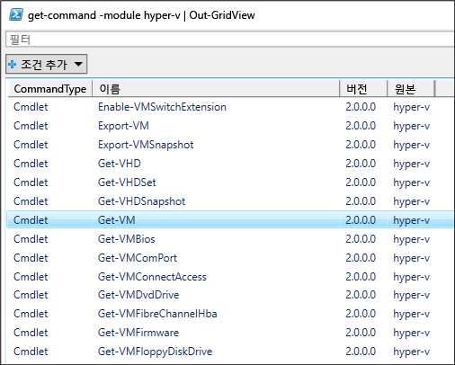
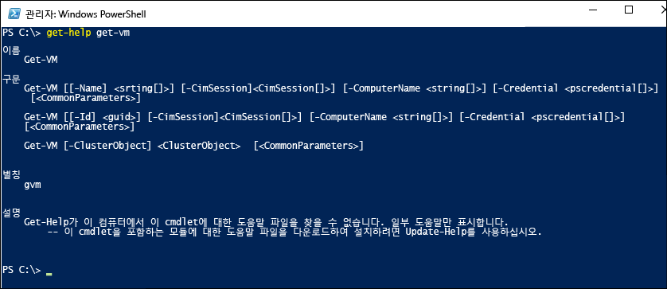
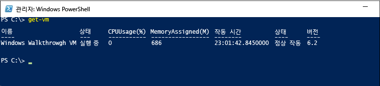

# <a name="working-with-hyper-v-and-windows-powershell"></a>Hyper-V 및 Windows PowerShell 사용

Hyper-V 배포, 가상 컴퓨터 만들기 및 이러한 가상 컴퓨터 관리의 기본 사항을 살펴보았으므로 이제 PowerShell 사용하여 이러한 다양한 작업을 자동화할 수 있는 방법을 살펴보겠습니다.

### <a name="return-a-list-of-hyper-v-commands"></a>Hyper-V 명령 목록 반환

1.  Windows 시작 단추를 클릭하고 **PowerShell**을 입력합니다.
2.  다음 명령을 실행하여 Hyper-V PowerShell 모듈과 함께 사용할 수 있는 검색 가능한 PowerShell 명령 목록을 표시합니다.

 ```powershell
Get-Command -Module hyper-v | Out-GridView
```
  다음과 같이 표시됩니다.

  

3. 특정 PowerShell 명령에 대한 자세한 내용을 보려면 `Get-Help`를 사용하세요. 예를 들어 다음 명령을 실행하면 `Get-VM` Hyper-V 명령에 대한 정보가 반환됩니다.

  ```powershell
  Get-Help Get-VM
  ```
 결과는 명령을 구성하는 방법, 필수 및 선택적 매개 변수가 무엇인지 및 사용할 수 있는 별칭을 보여 줍니다.

 


### <a name="return-a-list-of-virtual-machines"></a>가상 컴퓨터 목록 반환

`Get-VM` 명령을 사용하여 가상 컴퓨터 목록을 반환합니다.

1. PowerShell에서 다음 명령을 실행합니다.
 
 ```powershell
 Get-VM
 ```
 다음과 같이 표시됩니다.

 

2. 전원이 켜진 가상 컴퓨터 목록만 반환하려면 `Get-VM` 명령에 필터를 추가합니다. 필터는 `Where-Object` 명령을 사용하여 추가할 수 있습니다. 필터링에 대한 자세한 내용은 [Using the Where-Object(Where-Object 사용)](<https://docs.microsoft.com/previous-versions/windows/it-pro/windows-powershell-1.0/ee177028(v=technet.10)>) 설명서를 참조하세요.

 ```powershell
 Get-VM | where {$_.State -eq 'Running'}
 ```
3.  꺼져 있는 상태의 모든 가상 컴퓨터를 나열하려면 다음 명령을 실행합니다. 이 명령은 'Running'에서 'Off'로 변경된 필터를 사용한 2단계의 명령 복사본입니다.

 ```powershell
 Get-VM | where {$_.State -eq 'Off'}
 ```

### <a name="start-and-shut-down-virtual-machines"></a>가상 컴퓨터 시작 및 종료

1. 특정 가상 컴퓨터를 시작하려면 가상 컴퓨터의 이름으로 다음 명령을 실행합니다.

 ```powershell
 Start-VM -Name <virtual machine name>
 ```

2. 현재 전원이 꺼진 모든 가상 컴퓨터를 시작하려면 해당 컴퓨터 목록을 가져오고 `Start-VM` 명령에 목록을 파이프합니다.

  ```powershell
  Get-VM | where {$_.State -eq 'Off'} | Start-VM
  ```
3. 실행 중인 모든 가상 컴퓨터를 종료하려면 다음을 실행합니다.
 
  ```powershell
  Get-VM | where {$_.State -eq 'Running'} | Stop-VM
  ```

### <a name="create-a-vm-checkpoint"></a>VM 검사점 만들기

PowerShell을 사용하여 검사점을 만들려면 `Get-VM` 명령을 사용하여 가상 컴퓨터를 선택하고 이를 `Checkpoint-VM` 명령에 파이프합니다. 마지막으로 `-SnapshotName`을 사용하여 검사점에 이름을 지정합니다. 전체 명령은 다음과 같습니다.

 ```powershell
 Get-VM -Name <VM Name> | Checkpoint-VM -SnapshotName <name for snapshot>
 ```
### <a name="create-a-new-virtual-machine"></a>새 가상 컴퓨터 만들기

다음 예제는 PowerShell ISE(통합 스크립팅 환경)에서 새 가상 컴퓨터를 만드는 방법을 보여 줍니다. 이는 간단한 예이며 추가 PowerShell 기능 및 고급 VM 배포를 포함하도록 확장할 수 있습니다.

1. 시작 시에 PowerShell ISE를 열려면 **PowerShell ISE**를 입력합니다.
2. 다음 코드를 실행하여 가상 컴퓨터를 만듭니다. `New-VM` 명령에 대한 자세한 내용은 [New-VM](https://docs.microsoft.com/powershell/module/hyper-v/new-vm?view=win10-ps) 설명서를 참조하세요.

 ```powershell
  $VMName = "VMNAME"

  $VM = @{
      Name = $VMName
      MemoryStartupBytes = 2147483648
      Generation = 2
      NewVHDPath = "C:\Virtual Machines\$VMName\$VMName.vhdx"
      NewVHDSizeBytes = 53687091200
      BootDevice = "VHD"
      Path = "C:\Virtual Machines\$VMName"
      SwitchName = (Get-VMSwitch).Name
  }

  New-VM @VM
 ```

## <a name="wrap-up-and-references"></a>요약 및 참조

이 문서는 몇 가지 샘플 시나리오 뿐 아니라 Hyper-V PowerShell 모듈을 살펴보는 몇 가지 간단한 단계를 보여 주었습니다. Hyper-V PowerShell 모듈에 대한 자세한 내용은 [Windows PowerShell 참조의 Hyper-V Cmdlet](https://docs.microsoft.com/powershell/module/hyper-v/index?view=win10-ps)을 참조하세요.  
 
