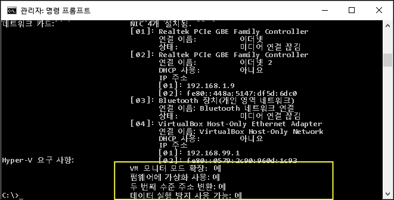

# <a name="windows-10-hyper-v-system-requirements"></a>Windows 10 Hyper-V 시스템 요구 사항

Hyper-v는 64 비트 버전의 Windows 10 Pro, Enterprise 및 Education에서 사용할 수 있습니다. Hyper-V는 Intel 및 AMD의 최신 세대 64비트 프로세서에서 제공하는 SLAT(두 번째 수준 주소 변환)가 필요합니다.

RAM이 4GB인 호스트에서 3~4개의 기본 가상 컴퓨터를 실행할 수 있고, 가상 컴퓨터 수가 늘면 더 많은 리소스가 필요합니다. 크게는 물리적 하드웨어에 따라 32개의 프로세서와 512GB RAM을 사용하는 대형 가상 컴퓨터를 만들 수도 있습니다.

## <a name="operating-system-requirements"></a>운영 체제 요구 사항

이러한 버전의 Windows 10에서 Hyper-V 역할을 활성화할 수 있습니다.

- Windows 10 Enterprise
- Windows10 Pro
- Windows 10 Education

다음 버전에는 Hyper-V 역할을 설치할 수 **없습니다**.

- Windows 10 Home
- Windows 10 Mobile
- Windows10 Mobile Enterprise

>Windows 10 Home 버전 Windows 10 Pro로 업그레이드할 수 있습니다. 그러려면 **설정** > **업데이트 및 보안** > **활성화**를 엽니다. 여기에서 스토어를 방문하고 업그레이드를 구입할 수 있습니다.

## <a name="hardware-requirements"></a>하드웨어 요구 사항

이 문서에서는 Hyper-V와 호환되는 하드웨어의 전체 목록을 제공하지 않지만 다음 항목은 필요합니다.
    
- 두 번째 수준 주소 변환(SLAT)을 사용하는 64비트 프로세서.
- VM 모니터 모드 확장(Intel CPU의 VT-c)을 지원하는 CPU.
- 최소 4GB의 메모리. 가상 컴퓨터는 Hyper-V 호스트와 메모리를 공유하지만 예상된 가상 워크로드를 처리하려면 충분한 메모리를 제공해야 합니다.

다음 항목을 시스템 BIOS에서 사용하도록 설정해야 합니다.
- 가상화 기술 - 마더보드 제조업체에 따라 다른 레이블이 있을 수 있습니다.
- 하드웨어 적용 데이터 실행 방지.

## <a name="verify-hardware-compatibility"></a>하드웨어 호환성 확인

호환성을 확인하려면 PowerShell 또는 명령 프롬프트(cmd.exe)를 열고 **systeminfo**를 입력합니다. 나열된 모든 Hyper-V 요구 사항이 **예**의 값을 가지는 경우 시스템은 Hyper-V 역할을 실행할 수 있습니다. 항목이 **아니요**를 반환하는 경우 이 문서에 나열된 요구 사항을 확인하고 가능한 경우 조정합니다.



기존 Hyper-V 호스트에서 **systeminfo**를 실행하는 경우 Hyper-V 요구 사항 섹션을 읽습니다.

```
Hyper-V Requirements: A hypervisor has been detected. Features required for Hyper-V will not be displayed.
```
