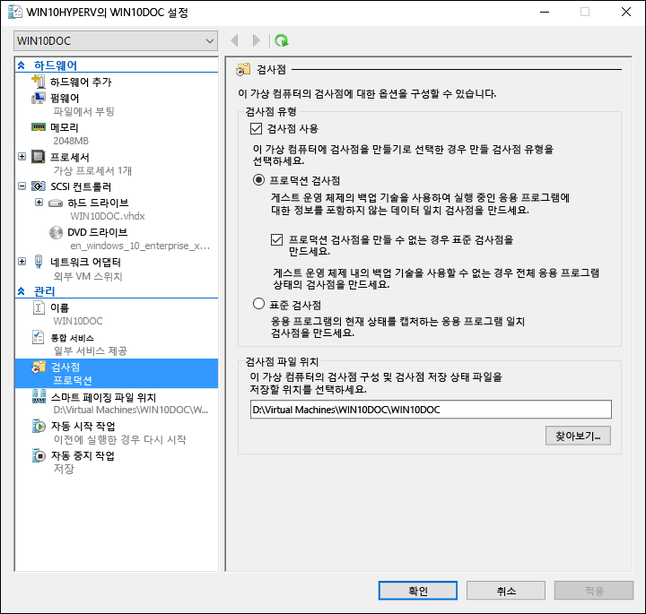
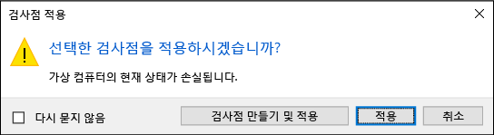
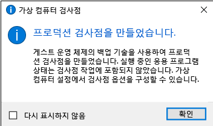

# <a name="using-checkpoints-to-revert-virtual-machines-to-a-previous-state"></a>검사점을 사용하여 가상 컴퓨터를 이정 상태로 되돌리기

가상화의 가장 큰 혜택 중 하나는 가상 컴퓨터의 상태를 쉽게 저장하는 기능입니다. Hyper-V에서 가상 컴퓨터 검사점의 사용을 통해 수행됩니다. 소프트웨어 구성을 변경, 소프트웨어 업데이트를 적용하거나 새 소프트웨어를 설치하기 전에 가상 컴퓨터 검사점을 만들려고 할 수 있습니다. 시스템 변경이 문제를 발생시킬 경우 가상 컴퓨터는 검사점이 수행되었던 때의 상태로 되돌릴 수 있습니다.

Windows 10 Hyper-V는 두 가지 유형의 검사점을 포함합니다.

* **표준 검사점**: 검사점이 시작 된 시간에 가상 컴퓨터 및 가상 컴퓨터 메모리 상태의 스냅숏을 합니다. 스냅숏은 전체 백업이 아니며 Active Directory와 같은 다른 노드 간에 데이터를 복제하는 시스템과 데이터 일관성 문제를 야기할 수 있습니다.  Hyper-V는 Windows 10 이전에 표준 검사점(이전의 스냅숏)만을 제공했습니다.

* **프로덕션 검사점**: Linux 가상 컴퓨터에서 가상 컴퓨터의 데이터 일관성 백업을 만듭니다 볼륨 섀도 복사본 서비스 또는 파일 시스템 고정을 사용 합니다. 가상 컴퓨터 메모리 상태의 스냅숏은 만들지 않습니다.

프로덕션 검사점은 기본으로 선택되지만 Hyper-V 관리자 또는 PowerShell을 사용하여 변경할 수 있습니다.

> **참고:** Hyper-V PowerShell 모듈에는 검사점 및 스냅숏을 교대로 사용할 수 있는 여러 가지 별칭이 있습니다.  
  이 문서에서는 검사점을 사용하지만 용어 스냅숏을 사용하여 비슷한 명령을 볼 수도 있습니다.

## <a name="changing-the-checkpoint-type"></a>검사점 유형 변경

**Hyper-V 관리자 사용**

1. Hyper-V 관리자를 엽니다.
2. 가상 컴퓨터를 마우스 오른쪽 단추로 클릭하고 **설정**을 선택합니다.
3. 관리에서 **검사점**을 선택합니다.
4. 원하는 검사점 유형을 선택합니다.

<br />


**PowerShell 사용**

다음 명령을 실행하여 PowerShell 통해 검사점을 변경할 수 있습니다. 

표준 검사점으로 설정:
```powershell
Set-VM -Name <vmname> -CheckpointType Standard
```

프로덕션 검사점으로 설정하고, 프로덕션 검사점이 실패하면 표준 검사점이 만들어집니다.
```powershell
Set-VM -Name <vmname> -CheckpointType Production
```

프로덕션 검사점으로 설정하고, 프로덕션 검사점이 실패하면 표준 검사점이 만들어지지 않습니다. 
```powershell
Set-VM -Name <vmname> -CheckpointType ProductionOnly
```

## <a name="creating-checkpoints"></a>검사점 만들기

가상 컴퓨터에 대해 구성된 유형의 검사점을 만듭니다. 이 유형을 변경하는 방법에 대한 지침은 이 문서의 앞부분에서 [검사점 유형 구성](checkpoints.md#changing-the-checkpoint-type) 섹션을 참조하세요.

**Hyper-V 관리자 사용**

검사점을 만들려면:  
1. Hyper-v 관리자에서 가상 컴퓨터를 선택합니다.
2. 가상 컴퓨터의 이름을 마우스 오른쪽 단추로 클릭하고 **검사점**을 클릭합니다.
3. 프로세스가 완료되면 **Hyper-V 관리자**의 **검사점** 아래에 해당 검사점이 표시됩니다.

**PowerShell 사용**

**CheckPoint-VM** 명령을 사용하여 검사점을 만듭니다.  

```powershell
Checkpoint-VM -Name <VMName>
```

검사점 프로세스가 완료된 경우 가상 컴퓨터에 대한 검사점 목록을 보려면 **Get-VMCheckpoint** 명령을 사용합니다.

```powershell
Get-VMCheckpoint -VMName <VMName>
```

## <a name="applying-checkpoints"></a>검사점 적용

가상 컴퓨터를 이전의 시점으로 되돌리려면 기존 검사점을 적용할 수 있습니다.

**Hyper-V 관리자 사용**

1.  **Hyper-V 관리자**의 **가상 컴퓨터**에서 가상 컴퓨터를 선택합니다.
2.  검사점 섹션에서 사용할 검사점을 마우스 오른쪽 단추로 클릭하고 **적용**을 클릭합니다.
3.  다음 옵션이 있는 대화 상자가 표시됩니다.  
  * **검사점을 만든 후 적용**: 이전 검사점을 적용하기 전에 가상 컴퓨터의 새로운 검사점을 만듭니다. 
  * **적용**: 선택한 검사점만 적용합니다. 이 작업은 취소할 수 없습니다.
  * **취소**: 작업을 수행하지 않고 대화 상자를 닫습니다.
  
  검사점을 만들어 적용하려면 적용 옵션 중 하나를 선택합니다.

**PowerShell 사용**

5. 가상 컴퓨터에 대한 검사점 목록을 보려면 **Get-VMCheckpoint** 명령을 사용합니다.

    ```powershell
    Get-VMCheckpoint -VMName <VMName>
    ```
6. 검사점을 적용하려면 **Restore-VMCheckpoint** 명령을 사용합니다.

    ```powershell
    Restore-VMCheckpoint -Name <checkpoint name> -VMName <VMName> -Confirm:$false
    ```

## <a name="renaming-checkpoints"></a>검사점 이름 바꾸기

다수의 검사점이 특정한 시점에 만들어집니다.  식별 가능한 이름이 지정 쉽게 검사점이 만들어졌을 때 시스템 상태에 대 한 세부 정보를 기억할 수 있습니다.

기본적으로, 검사점의 이름은 검사점을 만든 날짜 및 시간과 연결된 가상 컴퓨터의 이름입니다. 표준 형식은 다음과 같습니다. 

```
virtual_machine_name (MM/DD/YYY -hh:mm:ss AM\PM)
```

이름은 100자로 제한되며 비워 둘 수 없습니다. 

**Hyper-V 관리자 사용**

1.  **Hyper-v 관리자**에서 가상 컴퓨터를 선택합니다.
2.  검사점을 마우스 오른쪽 단추로 클릭한 다음 **이름 바꾸기**를 선택합니다.
3.  검사점에 대한 새 이름을 입력합니다. 이 필드는 100자 미만이어야 하며 비워둘 수 없습니다.
4.  작업을 마치면 **ENTER**를 클릭합니다.

**PowerShell 사용**

``` powershell
Rename-VMCheckpoint -VMName <virtual machine name> -Name <checkpoint name> -NewName <new checkpoint name>
```

## <a name="deleting-checkpoints"></a>검사점 삭제

검사점을 삭제하면 Hyper-V 호스트에 공간을 확보하는 데 도움이 됩니다.

내부적으로, 검사점은 가상 컴퓨터에 대한 .vhdx 파일과 동일한 위치에.avhdx 파일로 저장됩니다. 검사점을 삭제하면 Hyper-V는 .avhdx 및 .vhdx 파일을 병합합니다.  완료되면 검사점의 .avhdx 파일이 파일 시스템에서 삭제됩니다. 

.avhdx 파일을 직접 삭제하면 안 됩니다.
 
**Hyper-V 관리자 사용**

검사점을 확실히 제거하려면 

1.  **Hyper-v 관리자**에서 가상 컴퓨터를 선택합니다.
2.  **검사점** 섹션에서 삭제 하 고 삭제를 클릭 하 고 싶은 검사점을 마우스 오른쪽 단추로 클릭 합니다. 검사점과 모든 후속 검사점을 삭제할 수도 있습니다. 그렇게 하려면 삭제할 가장 빠른 검사점을 마우스 오른쪽 단추로 클릭하고 ****검사점 삭제** 하위 트리**를 클릭합니다.
3.  검사점 삭제를 확인하는 메시지가 나타날 수 있습니다. 검사점이 정확한지 확인하고 **삭제**를 클릭합니다. 
 
**PowerShell 사용**
```powershell
Remove-VMCheckpoint -VMName <virtual machine name> -Name <checkpoint name>
```

## <a name="exporting-checkpoints"></a>검사점 내보내기

내보내기는 검사점이 새로운 위치로 이동할 수 있도록 검사점을 가상 컴퓨터로 모읍니다. 가져온 후에는 검사점이 가상 컴퓨터로 복원됩니다. 내보낸 검사점은 백업에 사용될 수 있습니다.

**PowerShell 사용**
``` powershell
Export-VMCheckpoint -VMName <virtual machine name> -Name <checkpoint name> -Path <path for export>
```

## <a name="enable-or-disable-checkpoints"></a>검사점 사용 또는 사용 안 함

1.  **Hyper-V 관리자**에서 가상 컴퓨터의 이름을 마우스 오른쪽 단추로 클릭하고 **설정**을 클릭합니다.
2.  **관리** 섹션에서 **검사점**을 선택합니다.
3.  이 가상 컴퓨터에서 검사점을 지정하려면 검사점 사용을 선택해야 합니다(기본 동작).  
검사점을 사용하지 않으려면 **검사점 사용** 확인란의 선택을 취소합니다.
4.  변경 내용을 적용하려면 **적용**을 클릭합니다. 작업이 완료되면 **확인**을 클릭하여 대화 상자를 닫습니다.

## <a name="configure-checkpoint-location"></a>검사점 위치 구성

가상 컴퓨터에 검사점이 없는 경우 검사점 구성과 상태 파일의 저장 위치를 변경할 수 있습니다.

1.  **Hyper-V 관리자**에서 가상 컴퓨터의 이름을 마우스 오른쪽 단추로 클릭하고 **설정**을 클릭합니다.    
2.  **관리** 섹션에서 **검사점** 또는 **검사점 파일 위치**를 선택합니다.  
4.  **검사점 파일 위치**에서 파일을 저장하려는 폴더의 경로를 입력합니다.  
5.  변경 내용을 적용하려면 **적용**을 클릭합니다. 작업이 완료되면 **확인**을 클릭하여 대화 상자를 닫습니다.

검사점 구성 파일이 저장되는 기본 위치는 `%systemroot%\ProgramData\Microsoft\Windows\Hyper-V\Snapshots`입니다.


<!-- This belongs in dev docs

This folder will contain the .VMRS file with the runtime and saved state data and a .VMCX configuration file, which uses the checkpoint GUID as the file name.
-->

## <a name="checkpoint-demo"></a>검사점 데모

이 연습은 프로덕션 검사점에 대비하여 표준 검사점을 만들고 적용하는 것을 안내합니다.  이 예에서는 가상 컴퓨터를 간단히 변경하고 달라진 작동을 관찰합니다. 

### <a name="standard-checkpoint"></a>표준 검사점

1. 가상 컴퓨터에 로그인하고 바탕 화면에 텍스트 파일을 만듭니다.
2. 메모장으로 파일을 열고 텍스트 '이것이 표준 검사점입니다.'를 입력합니다. **파일을 저장하거나 메모장을 닫지 마세요**.  
3. 검사점을 표준으로 변경합니다. 지침은 [여기](checkpoints.md#changing-the-checkpoint-type)를 참조하세요.
4. 새 검사점을 만듭니다.

<br />
 

**Hyper-V 관리자를 사용하여 표준 검사점 적용**

이제 검사점이 존재하므로 가상 컴퓨터를 수정한 다음 가상 컴퓨터를 저장된 상태로 되돌릴 검사점을 적용합니다. 

1. 여전히 열고 가상 컴퓨터의 바탕 화면에서 삭제 경우 텍스트 파일을 닫습니다.
2. Hyper-V 관리자를 열고 표준 검사점을 마우스 오른쪽 단추로 클릭하고 적용을 선택합니다.
3. 검사점 적용 알림 창에서 적용을 선택합니다.

<br />
 

검사점이 적용되면 시스템은 텍스트 파일이 존재할 때 뿐만 아니라 검사점이 만들어졌을 때의 정확한 상태에 있습니다. 이 경우 메모장이 열리고 텍스트 파일이 로드됩니다.

### <a name="production-checkpoint"></a>프로덕션 검사점

이제 프로덕션 검사점을 살펴보겠습니다. 이 프로세스는 표준 검사점 작업과 거의 동일하지만 약간 다른 결과를 갖게 됩니다. 시작하기 전에 가상 컴퓨터가 있고 검사점 유형을 프로덕션 검사점으로 변경했는지 확인합니다.

**가상 컴퓨터 수정 및 프로덕션 검사점 만들기**

1. 가상 컴퓨터에 로그인하고 새 텍스트 파일을 만듭니다. 이전 연습을 따른 경우 기존 텍스트 파일을 사용할 수 있습니다.
2. '이것이 프로덕션 검사점입니다.'를 텍스트 파일에 입력하고  파일을 저장하지만 **메모장을 닫지 않습니다**.
3. Hyper-v 관리자를 열고, 가상 컴퓨터를 마우스 오른쪽 단추로 클릭 하 고 **검사점**을 선택 합니다.
4. 프로덕션 검사점을 만들었습니다 창에서 **확인**을 클릭합니다.

<br />
 
    
**Hyper-V 관리자를 사용하여 프로덕션 검사점 적용**

이제 검사점이 존재하므로 시스템을 수정한 다음 가상 컴퓨터를 저장된 상태로 되돌릴 검사점을 적용합니다. 

1. 여전히 열고 가상 컴퓨터의 바탕 화면에서 삭제 경우 텍스트 파일을 닫습니다.
2. Hyper-v 관리자를 열고, 프로덕션 검사점을 마우스 오른쪽 단추로 클릭 하 고 **적용**을 선택 합니다.
3. 검사점 적용 알림 창에서 **적용**을 선택합니다.

프로덕션 검사점이 적용되면 가상 컴퓨터가 꺼짐 상태가 됩니다.

1. 시작하고 가상 컴퓨터에 로그인합니다.
2. 텍스트 파일이 복원된 것을 확인합니다. 하지만 표준 검사점과 달리 메모장은 열려 있지 않습니다.   
