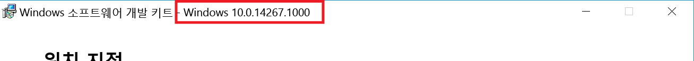

# 고유한 통합 서비스 만들기

Windows 10부터, 누구나 Hyper-V 호스트와 Hyper-V 호스트에서 실행 중인 가상 컴퓨터 간에 새 소켓 기반 통신을 사용하여 기본 제공 Hyper-V 통합 서비스와 아주 유사한 서비스를 만들 수 있습니다.  이러한 Hyper-V 소켓을 사용하면 서비스가 네트워킹 스택과는 독립적으로 실행될 수 있고 모든 데이터가 동일한 물리적 메모리에 머물게 됩니다.

이 문서에서는 Hyper-V 소켓에 구축된 간단한 응용 프로그램을 만들어 사용하는 방법을 안내합니다.

[PowerShell Direct](../user-guide/powershell-direct.md)는 Hyper-V 소켓을 사용하여 통신하는 응용 프로그램 예제(이 경우 기본 제공 Windows 서비스)입니다.

**지원되는 호스트 OS**
* Windows 10 빌드 14290 이상
* Windows Server Technical Preview 4 이상
* 앞으로의 릴리스(서버 2016 +)

**지원되는 게스트 OS**
* Windows 10
* Windows Server Technical Preview 4 이상
* 앞으로의 릴리스(서버 2016 +)
* Linux 통합 서비스를 포함하는 Linux 게스트([Supported Linux and FreeBSD virtual machines for Hyper-V on Windows(Windows의 Hyper-V에 대해 지원되는 Linux 및 FreeBSD 가상 컴퓨터)](https://technet.microsoft.com/library/dn531030(ws.12).aspx) 참조)

**기능 및 제한 사항**  
* 커널 모드 또는 사용자 모드 동작 지원  
* 데이터 스트림만      
* 블록 메모리 없음(백업/비디오에는 적합하지 않음)   

--------------

## 시작하기
이제 Hyper-V 소켓을 네이티브 코드(C/C++)에서 사용할 수 있습니다.  

간단한 응용 프로그램을 작성하기 위해 다음이 필요합니다.
* C 컴파일러.  없으면 [Visual Studio 커뮤니티](https://aka.ms/vs)를 확인하세요.
* Hyper-V를 실행하는 컴퓨터와 가상 컴퓨터  
  * 호스트 및 게스트(VM) 운영 체제는 Windows 10, Windows Server Technical Preview 3 이상이어야 합니다.
* Hyper-V 호스트에 설치된 [Windows 10 SDK](http://aka.ms/flightingSDK)

**Windows SDK 정보**

Windows SDK 링크:
* [참가자용 Windows 10 SDK Preview](http://aka.ms/flightingSDK)
* [Windows 10 SDK](https://dev.windows.com/en-us/downloads/windows-10-sdk)

Windows 10 빌드 14290에서는 Hyper-V 소켓용 API를 사용할 수 있게 되었습니다. 플라이팅 다운로드는 최신 참가자 Fast Track 플라이팅 빌드와 일치합니다.  
이상한 동작이 발생하는 경우 [TechNet 포럼](https://social.technet.microsoft.com/Forums/windowsserver/en-US/home "TechNet Forums")에서 알려주세요.  게시물에 다음 내용을 포함하세요.
* 예기치 않은 동작 
* 호스트, 게스트 및 SDK의 OS 및 빌드 번호  
  
  SDK 빌드 번호는 SDK 설치 관리자의 제목에 표시됩니다.  
  


## 새 응용 프로그램 등록
Hyper-V 소켓을 사용하려면 응용 프로그램을 Hyper-V 호스트의 레지스트리에 등록해야 합니다.

레지스트리에 서비스를 등록하면 다음이 가능합니다.
*  WMI 관리를 통해 서비스 사용, 사용 안 함 및 사용 가능한 서비스 나열
*  가상 컴퓨터와 직접 통신할 수 있는 권한

다음 PowerShell은 이름이 "HV Socket Demo"인 새 응용 프로그램을 등록합니다.  관리자 권한으로 실행해야 합니다.  수동 지침은 다음과 같습니다.

``` PowerShell
$friendlyName = "HV Socket Demo"

# Create a new random GUID and add it to the services list then add the name as a value

$service = New-Item -Path "HKLM:\SOFTWARE\Microsoft\Windows NT\CurrentVersion\Virtualization\GuestCommunicationServices" -Name ((New-Guid).Guid)

$service.SetValue("ElementName", $friendlyName)

# Copy GUID to clipboard for later use
$service.PSChildName | clip.exe
```

** 레지스트리 위치 및 정보 **  

``` 
HKEY_LOCAL_MACHINE\SOFTWARE\Microsoft\Windows NT\CurrentVersion\Virtualization\GuestCommunicationServices\
```  
이 레지스트리 위치에는 여러 GUID가 있습니다.  모두 기본 제공 서비스입니다.

서비스별 레지스트리 정보:
* `Service GUID`   
    * `ElementName (REG_SZ)` -- 이 서비스의 친근한 이름

고유 서비스를 등록하려면 자체 GUID 및 친근한 이름을 사용하여 새 레지스트리 키를 만듭니다.

친근한 이름이 새 응용 프로그램과 연결됩니다.  이 이름은 성능 카운터와 GUID가 적합하지 않은 다른 위치에 표시됩니다.

레지스트리 항목은 다음과 같이 표시됩니다.
```
HKEY_LOCAL_MACHINE\SOFTWARE\Microsoft\Windows NT\CurrentVersion\Virtualization\GuestCommunicationServices\
    999E53D4-3D5C-4C3E-8779-BED06EC056E1\
        ElementName REG_SZ  VM Session Service
    YourGUID\
        ElementName REG_SZ  Your Service Friendly Name
```

> ** 팁: **  PowerShell에서 GUID를 생성하고 클립보드에 복사하려면 다음을 실행합니다.  
``` PowerShell
(New-Guid).Guid | clip.exe
```

## Hyper-V 소켓 만들기

대부분의 기본적인 경우 소켓을 정의하려면 주소 집합, 연결 유형 및 프로토콜이 필요합니다.

간단한 [소켓 정의](
https://msdn.microsoft.com/en-us/library/windows/desktop/ms740506(v=vs.85).aspx
)

``` C
SOCKET WSAAPI socket(
  _In_ int af,
  _In_ int type,
  _In_ int protocol
);
``` 

Hyper-V 소켓의 경우:
* 주소 집합 - `AF_HYPERV`
* 유형 - `SOCK_STREAM`
* 프로토콜 - `HV_PROTOCOL_RAW`


선언/인스턴스화 예제는 다음과 같습니다.  
``` C
SOCKET sock = socket(AF_HYPERV, SOCK_STREAM, HV_PROTOCOL_RAW);
```


## Hyper-V 소켓에 바인딩

소켓을 연결 정보에 바인딩합니다.

편의를 위해 아래에 함수 정의를 복사해 두었으므로 바인딩에 대한 자세한 내용은 [여기](https://msdn.microsoft.com/en-us/library/windows/desktop/ms737550.aspx)를 참조하세요.

``` C
int bind(
  _In_ SOCKET                s,
  _In_ const struct sockaddr *name,
  _In_ int                   namelen
);
```

호스트 컴퓨터의 IP 주소와 해당 호스트의 포트 번호로 구성된 표준 인터넷 프로토콜 주소 집합(`AF_INET`)의 소켓 주소와는 달리, `AF_HYPERV`는 위에서 정의한 가상 컴퓨터의 ID와 응용 프로그램 ID를 사용하여 연결을 수립합니다. 

Hyper-V 소켓은 네트워킹 스택, TCP/IP, DNS 등에 종속되지 않으므로, 소켓 끝점에서 호스트 이름이 아니라 연결을 분명히 설명하는 비 IP 형식이 필요합니다.

Hyper-V 소켓의 소켓 주소 정의는 다음과 같습니다.

``` C
struct SOCKADDR_HV
{
     ADDRESS_FAMILY Family;
     USHORT Reserved;
     GUID VmId;
     GUID ServiceId;
};
```

IP 또는 호스트 이름 대신 AF_HYPERV 끝점은 다음 두 GUID에 크게 의존합니다.  
* VM ID – VM마다 할당된 고유의 ID입니다.  VM ID는 다음 PowerShell 코드 조각을 사용하여 찾을 수 있습니다.  
  ```PowerShell
  (Get-VM -Name $VMName).Id
  ```
* 서비스 ID – [위에서 설명한](#RegisterANewApplication) GUID로, Hyper-V 호스트 레지스트리에 응용 프로그램과 함께 등록되어 있습니다.

특정 가상 컴퓨터에 대한 연결이 아닌 경우 VMID 와일드 카드 집합도 사용할 수 있습니다. 
 
### VMID 와일드카드

| 이름 | GUID | 설명 |
|:-----|:-----|:-----|
| HV_GUID_ZERO | 00000000-0000-0000-0000-000000000000 | 수신기를 이 VMID에 등록해야 모든 파티션으로부터의 연결을 수락할 수 있습니다. |
| HV_GUID_WILDCARD | 00000000-0000-0000-0000-000000000000 | 수신기를 이 VMID에 등록해야 모든 파티션으로부터의 연결을 수락할 수 있습니다. |
| HV_GUID_BROADCAST | FFFFFFFF-FFFF-FFFF-FFFF-FFFFFFFFFFFF | |  
| HV_GUID_CHILDREN | 90db8b89-0d35-4f79-8ce9-49ea0ac8b7cd | 자식에 대한 와일드 카드 주소입니다. 수신기를 이 VMID에 등록해야 모든 자식으로부터의 연결을 수락할 수 있습니다. |
| HV_GUID_LOOPBACK | e0e16197-dd56-4a10-9195-5ee7a155a838 | 루프백 주소  이 VMID 연결을 사용하면 커넥터와 동일한 파티션에 연결합니다. |
| HV_GUID_PARENT | a42e7cda-d03f-480c-9cc2-a4de20abb878 | 부모 주소입니다. 이 VMID 연결을 사용하면 커넥터와 동일한 부모 파티션에 연결합니다.* |


***HV_GUID_PARENT**  
가상 컴퓨터의 부모는 해당 호스트입니다.  컨테이너의 부모는 컨테이너의 호스트입니다.  
가상 컴퓨터에서 실행 중인 컨테이너로부터의 연결은 해당 컨테이너를 호스팅하는 VM에 연결합니다.  
이 VMID에서의 수신은 다음으로부터의 연결을 허용합니다.  
(컨테이너 내): 컨테이너 호스트  
(VM 내: 컨테이너 호스트/컨테이너 없음): VM 호스트  
(VM 내부 아님: 컨테이너 호스트/컨테이너 없음): 지원 안 함

## 지원되는 소켓 명령

Socket()  
Bind()  
Connect()  
Send()  
Listen()  
Accept()  

[WinSock API 완료](https://msdn.microsoft.com/en-us/library/windows/desktop/ms741394.aspx)


<!--HONumber=Jan17_HO2-->


