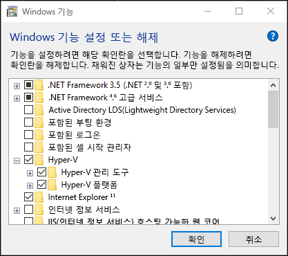
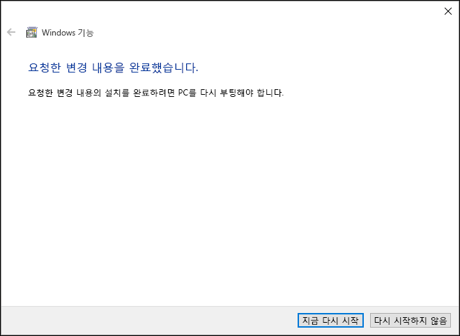

# Windows 10에 Hyper-V 설치

Windows 10에서 가상 컴퓨터를 만들려면 먼저 Hyper-V 역할을 활성화해야 합니다. Windows 10 제어판, PowerShell 또는 배포 이미지 서비스 및 관리 도구(DISM)를 사용하여 실행할 수 있습니다. 이 문서는 이러한 단계를 살펴 봅니다.

> Hyper-V를 활성화하기 전에 시스템과 호환되는지 확인합니다. 자세한 내용은 [Windows 10 Hyper-V 시스템 요구 사항](https://msdn.microsoft.com/virtualization/hyperv_on_windows/quick_start/walkthrough_compatibility)을 참조하세요.

## Hyper-V 역할을 수동으로 설치

1. Windows 단추를 마우스 오른쪽 단추로 클릭하고 '프로그램 및 기능'을 선택합니다.

2. **Windows 기능 사용/사용 안 함**을 선택합니다.

3. **Hyper-V**를 선택하고 **확인**을 클릭합니다.  



설치가 완료되면 컴퓨터를 다시 시작하라는 메시지가 표시됩니다.



## PowerShell을 사용하여 Hyper-V 설치

1. 관리자 권한으로 PowerShell 콘솔을 엽니다.

2. 다음 명령을 실행합니다.

```powershell
Enable-WindowsOptionalFeature -Online -FeatureName Microsoft-Hyper-V -All
```
설치가 완료되면 컴퓨터를 다시 부팅해야 합니다.

## DISM을 사용하여 Hyper-V 설치

배포 이미지 서비스 및 관리 도구 또는 DISM은 Windows 이미지를 서비스하고 Windows 사전 설치 환경을 준비하는 데 사용됩니다. DISM은 Windows 운영 체제가 실행되는 동안 Windows 기능을 활성화하는 데도 사용할 수 있습니다. 자세한 내용은 [DISM 기술 참조](https://technet.microsoft.com/en-us/library/hh824821.aspx)를 참조하세요.

DISM을 사용하여 Hyper-V 역할을 활성화하려면:

1. 관리자 권한으로 PowerShell 또는 CMD 세션을 엽니다.

2. 다음 명령을 입력합니다.

```powershell
DISM /Online /Enable-Feature /All /FeatureName:Microsoft-Hyper-V
```


## 다음 단계 - 가상 스위치 만들기
[가상 스위치 만들기](walkthrough_virtual_switch.md)


<!--HONumber=Oct16_HO4-->


