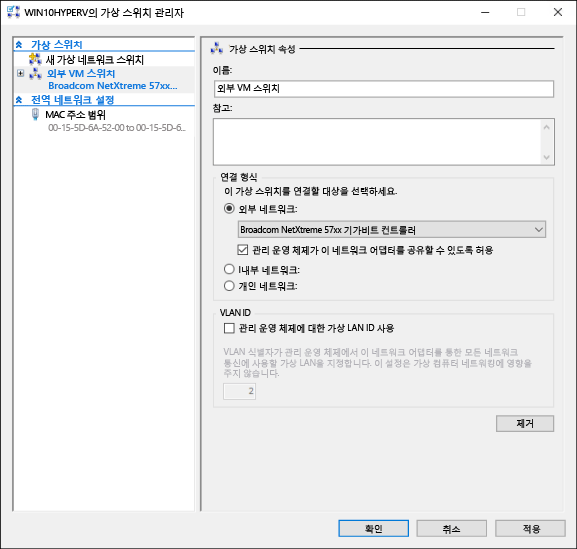
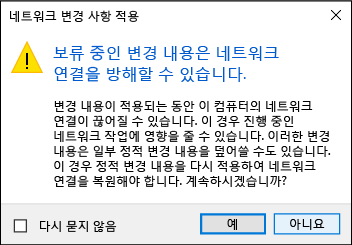

# 가상 스위치 만들기 

Hyper-V에서 가상 컴퓨터를 만들려면 먼저 이 가상 컴퓨터를 실제 네트워크에 연결하는 방법을 제공해야 할 수 있습니다. Hyper-V는 가상 컴퓨터의 네트워크 카드를 가상 스위치에 연결할 수 있는 소프트웨어 기반 네트워킹 기술을 포함하여 네트워크 연결을 제공합니다. Hyper-V에서 만든 각 가상 스위치는 세 가지 연결 유형 중 하나로 구성할 수 있습니다.

- **외부 네트워크** – 가상 스위치는 실제 네트워크, Hyper-V 호스트 및 가상 컴퓨터 간의 연결을 제공하는 실제 네트워크 어댑터에 연결됩니다. 이 구성에서는 물리적으로 연결된 네트워크 카드를 통해 통신할 수 있는 호스트의 기능을 사용하거나 사용하지 않도록 설정할 수도 있습니다. 이는 특정 실제 네트워크 카드에 VM 트래픽만을 격리하는 데 유용할 수 있습니다.

- **내부 네트워크** – 가상 스위치가 실제 네트워크 어댑터에 연결되어 있지 않습니다. 그러나 Hyper-V 호스트와 이 스위치에 연결된 모든 가상 컴퓨터 간에는 네트워크 연결이 있습니다.

- **개인 네트워크** – 가상 스위치가 실제 네트워크 어댑터에 연결되어 있지 않고 Hyper-V 호스트와 이 스위치에 연결된 가상 컴퓨터 간에 연결이 없습니다.

## 수동으로 가상 스위치 만들기

이 연습에서는 Hyper-V 관리자를 사용하여 외부 가상 스위치를 만드는 방법을 안내합니다. 완료되면 Hyper-V 호스트는 가상 컴퓨터를 실제 네트워크에 연결하는 데 사용할 수 있는 가상 스위치를 포함합니다. 

1. Hyper-V 관리자를 엽니다.

2. Hyper-V 호스트의 이름을 마우스 오른쪽 단추로 클릭하고 **가상 스위치 관리자...**를 선택합니다.

3. '가상 스위치'에서 **새 가상 네트워크 스위치**를 선택합니다.

4. '만들려는 가상 스위치 유형을 선택하세요.'에서 **외부**를 선택합니다.

5. **가상 스위치 만들기** 단추를 선택합니다.

6. '가상 스위치 속성'에서 새 스위치에 **외부 VM 스위치** 같은 이름을 지정합니다.

7. '연결 형식'에서 **외부 네트워크**가 선택되었는지 확인합니다.

8. 새 가상 스위치와 연결할 실제 네트워크 카드를 선택합니다. 이 네트워크 카드는 네트워크에 물리적으로 연결되어 있습니다.  

    

9. **적용**을 선택하여 가상 스위치를 만듭니다. 이때 다음과 같은 메시지가 표시될 가능성이 높습니다. **예**를 클릭하여 계속합니다.

      

10. **확인**을 선택하여 가상 스위치 관리자 창을 닫습니다.

## PowerShell을 사용하여 가상 스위치 만들기

다음 단계는 PowerShell을 사용하여 외부 연결로 가상 스위치를 만드는 데 사용할 수 있습니다. 

1. **Get-NetAdapter**를 사용하여 Windows 10 시스템에 연결된 네트워크 어댑터의 목록을 반환합니다.

    ```powershell
    PS C:\> Get-NetAdapter

    Name                      InterfaceDescription                    ifIndex Status       MacAddress             LinkSpeed
    ----                      --------------------                    ------- ------       ----------             ---------
    Ethernet 2                Broadcom NetXtreme 57xx Gigabit Cont...       5 Up           BC-30-5B-A8-C1-7F         1 Gbps
    Ethernet                  Intel(R) PRO/100 M Desktop Adapter            3 Up           00-0E-0C-A8-DC-31        10 Mbps  
    ```

2. Hyper-V 스위치와 함께 사용할 네트워크 어댑터를 선택하고 **$net**이라는 변수에 인스턴스를 배치합니다.

    ```
    $net = Get-NetAdapter -Name 'Ethernet'
    ```

3. 다음 명령을 실행하여 새 Hyper-V 가상 스위치를 만듭니다.

    ```
    New-VMSwitch -Name "External VM Switch" -AllowManagementOS $True -NetAdapterName $net.Name
    ```

## 가상 스위치 및 랩톱

노트북에서 Windows 10 Hyper-V를 실행하는 경우 이더넷 및 무선 네트워크 카드에 대해 가상 스위치를 만들 수 있습니다. 이 구성을 사용하면 노트북이 네트워크에 연결된 방법에 따라 이러한 스위치 간에 가상 컴퓨터를 변경할 수 있습니다. 가상 컴퓨터는 유선 및 무선 간에 자동으로 전환되지 않습니다.

## 다음 단계 - 가상 컴퓨터 만들기
[Windows 가상 컴퓨터 만들기](walkthrough_create_vm.md)


<!--HONumber=Oct16_HO4-->


