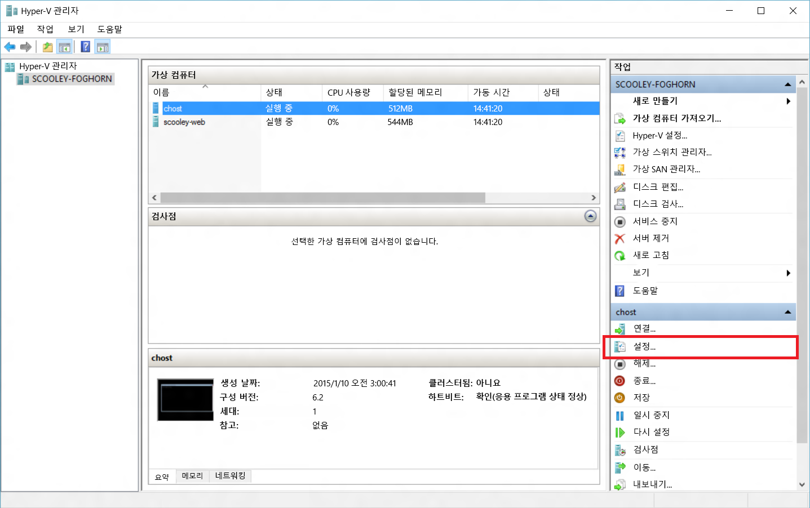
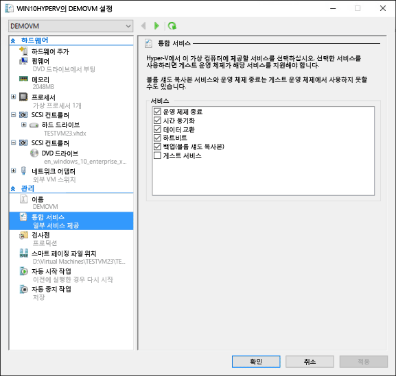
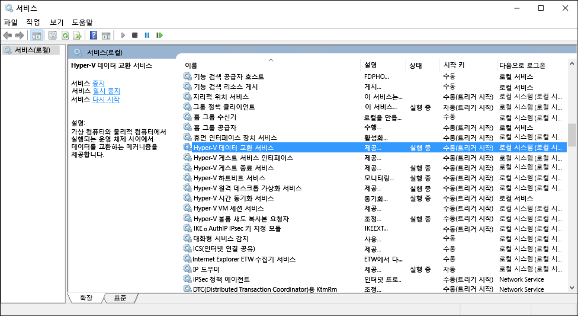

# Hyper-V 통합 서비스 관리

통합 서비스(통합 구성 요소라고도 함)는 가상 컴퓨터가 Hyper-V 호스트와 통신하도록 허용하는 서비스입니다. 이러한 서비스 중 상당수는 편리하며(예: 게스트 파일 복사) 나머지 서비스는 게스트 운영 체제의 기능이 제대로 작동하는 데 매우 중요할 수 있습니다(시간 동기화).

이 문서에서는 Windows 10에서 Hyper-V 관리자 및 PowerShell을 사용하여 통합 서비스를 관리하는 방법을 자세히 설명합니다. 각 개별 통합 서비스에 대한 자세한 내용은 [통합 서비스](https://technet.microsoft.com/en-us/library/dn798297.aspx)를 참조하세요.

## Hyper-V 관리자를 사용하여 통합 서비스 활성화 또는 비활성화

1. 가상 컴퓨터를 선택하고 설정을 엽니다.


2. 가상 컴퓨터 설정 창에서 관리 아래의 통합 서비스 탭으로 이동합니다.



여기에서 Hyper-V 호스트에서 사용할 수 있는 모든 통합 서비스를 볼 수 있습니다. 게스트 운영 체제는 나열된 모든 통합 시스템을 지원하거나 지원하지 않을 수 있습니다.

## PowerShell을 사용하여 통합 서비스 활성화 또는 비활성화

[`Enable-VMIntegrationService`](https://technet.microsoft.com/en-us/library/hh848500.aspx) 및 [`Disable-VMIntegrationService`](https://technet.microsoft.com/en-us/library/hh848488.aspx)를 실행하여 PowerShell로 통합 서비스를 활성화하거나 비활성화할 수 있습니다.

이 예제에서는 위에서 설명한 "demovm" 가상 컴퓨터에서 게스트 파일 복사 통합 서비스를 활성화한 다음 비활성화합니다.

1. 실행 중인 통합 서비스 보기

  ``` PowerShell
  Get-VMIntegrationService -VMName "demovm"
  ```

출력은 다음과 같이 표시됩니다.
  ``` PowerShell
  VMName      Name                    Enabled PrimaryStatusDescription SecondaryStatusDescription
  ------      ----                    ------- ------------------------ --------------------------
  demovm      Guest Service Interface False   OK
  demovm      Heartbeat               True    OK                       OK
  demovm      Key-Value Pair Exchange True    OK
  demovm      Shutdown                True    OK
  demovm      Time Synchronization    True    OK
  demovm      VSS                     True    OK
  ```

2. `게스트 서비스 인터페이스` 통합 서비스 활성화

   ``` PowerShell
   Enable-VMIntegrationService -VMName "demovm" -Name "Guest Service Interface"
   ```

`Get-VMIntegrationService -VMName "demovm"`을 실행하는 경우 게스트 서비스 인터페이스 통합 서비스가 활성화되어 표시됩니다.

3. `게스트 서비스 인터페이스` 통합 서비스 비활성화

   ``` PowerShell
   Disable-VMIntegrationService -VMName "demovm" -Name "Guest Service Interface"
   ```

통합 서비스는 호스트와 게스트 모두에서 작동하기 위해 활성화하도록 설계되었습니다. 모든 통합 서비스는 Windows 게스트 운영 체제에서 기본적으로 활성화되지만 비활성화할 수 있습니다. 다음 섹션에서 방법을 살펴봅니다.


## 게스트 OS (Windows)에서 통합 서비스 관리

>**참고:** 통합 서비스 비활성화는 가상 컴퓨터를 관리하는 호스트 기능에 심각한 영향을 줄 수 있습니다. 통합 서비스는 호스트와 게스트 모두에서 작동하도록 활성화되어야 합니다.

통합 서비스는 windows에서 서비스로 표시됩니다. 가상 컴퓨터 내에서 통합 서비스를 활성화하거나 비활성화하려면 Windows 서비스 관리자를 엽니다.



이름에 Hyper-V를 포함하는 서비스를 찾습니다. 활성화 또는 비활성화하려는 서비스를 오른쪽 단추로 클릭하고 서비스를 시작하거나 중지합니다.

또는 PowerShell 사용하여 모든 통합 서비스를 보려면 다음을 실행합니다.

```PowerShell
Get-Service -Name vm*
```

다음과 같이 표시하는 목록을 반환합니다.

```PowerShell
Status   Name               DisplayName
------   ----               -----------
Running  vmicguestinterface Hyper-V Guest Service Interface
Running  vmicheartbeat      Hyper-V Heartbeat Service
Running  vmickvpexchange    Hyper-V Data Exchange Service
Running  vmicrdv            Hyper-V Remote Desktop Virtualizati...
Running  vmicshutdown       Hyper-V Guest Shutdown Service
Running  vmictimesync       Hyper-V Time Synchronization Service
Stopped  vmicvmsession      Hyper-V VM Session Service
Running  vmicvss            Hyper-V Volume Shadow Copy Requestor
```

[`Start-Service`](https://technet.microsoft.com/en-us/library/hh849825.aspx) 또는 [`Stop-Service`](https://technet.microsoft.com/en-us/library/hh849790.aspx)를 사용하여 서비스를 시작하거나 중지합니다.

기본적으로 모든 통합 서비스는 게스트 운영 체제에서 활성화됩니다.

## 게스트 OS(Linux)에서 통합 서비스 관리

Linux 통합 서비스는 일반적으로 Linux 커널을 통해 제공됩니다.

통합 서비스 드라이버 및 디먼이 Linux 게스트 운영 체제에서 다음 명령을 실행하여 실행 중인지 확인합니다.

1. Linux 통합 서비스 드라이버는 'hv_utils'라고 합니다. 로드되었는지 확인하려면 다음을 실행합니다.

  ``` BASH
  lsmod | grep hv_utils
  ```

출력은 다음과 같아야 합니다.

  ``` BASH
  Module                  Size   Used by
  hv_utils               20480   0
  hv_vmbus               61440   8 hv_balloon,hyperv_keyboard,hv_netvsc,hid_hyperv,hv_utils,hyperv_fb,hv_storvsc
  ```

2. Linux 게스트 운영 체제에서 다음 명령을 실행하여 필요한 디먼이 실행 중인지 확인합니다.

  ``` BASH
  ps -ef | grep hv
  ```

출력은 다음과 같아야 합니다.

  ``` BASH
  root       236     2  0 Jul11 ?        00:00:00 [hv_vmbus_con]
  root       237     2  0 Jul11 ?        00:00:00 [hv_vmbus_ctl]
  ...
  root       252     2  0 Jul11 ?        00:00:00 [hv_vmbus_ctl]
  root      1286     1  0 Jul11 ?        00:01:11 /usr/lib/linux-tools/3.13.0-32-generic/hv_kvp_daemon
  root      9333     1  0 Oct12 ?        00:00:00 /usr/lib/linux-tools/3.13.0-32-generic/hv_kvp_daemon
  root      9365     1  0 Oct12 ?        00:00:00 /usr/lib/linux-tools/3.13.0-32-generic/hv_vss_daemon
  scooley  43774 43755  0 21:20 pts/0    00:00:00 grep --color=auto hv          
  ```

사용할 수 있는 디먼을 보려면 다음을 실행합니다.
  ``` BASH
  compgen -c hv_
  ```

출력은 다음과 같아야 합니다.

  ``` BASH
  hv_vss_daemon
  hv_get_dhcp_info
  hv_get_dns_info
  hv_set_ifconfig
  hv_kvp_daemon
  hv_fcopy_daemon     
  ```

통합 서비스 디먼이 표시됩니다.
* **`hv_vss_daemon`** - 이 디먼은 라이브 Linux 가상 컴퓨터 백업을 만드는 데 필요합니다.
* **`hv_kvp_daemon`** - 이 디먼을 통해 내장 및 외장 키 값 쌍을 설정 및 쿼리할 수 있습니다.
* **`hv_fcopy_daemon`** - 이 디먼은 호스트와 게스트 사이의 서비스를 복사하는 파일을 구현합니다.

>**참고:** 위의 통합 서비스 디먼을 사용할 수 없는 경우 시스템에서 지원되지 않거나 설치되지 않았을 수 있습니다. [여기](https://technet.microsoft.com/en-us/library/dn531030.aspx)에서 더 많은 특정 정보에 대해 알아보세요.

이 예제에서는 KVP 디먼 `hv_kvp_daemon`을 중지하고 시작합니다.

위 출력의 두 번째 열에 있는 pid(프로세스 ID)를 사용하여 디먼의 프로세스를 중지합니다. 또는 `pidof`를 사용하여 올바른 프로세스를 찾을 수 있습니다. Hyper-V 디먼은 루트로 실행하므로 루트 권한이 필요 없습니다.

``` BASH
sudo kill -15 `pidof hv_kvp_daemon`
```

이제 `ps -ef | hv`를 다시 실행하는 경우 모든 `hv_kvp_daemon` 프로세스가 사라지게 됩니다.

디먼을 다시 시작하려면 디먼을 루트로 실행합니다.

``` BASH
sudo hv_kvp_daemon
```

이제 `ps -ef | hv`를 다시 실행하는 경우 `hv_kvp_daemon` 프로세스가 새로운 프로세스 ID로 표시됩니다.


## 통합 서비스 유지 관리

최상의 가상 컴퓨터 성능 및 기능을 받으려면 통합 서비스를 최신 상태로 유지합니다.

**Windows 10 호스트에서 실행되는 가상 컴퓨터:**

| 게스트 OS| 업데이트 메커니즘| 참고|
|:---------|:---------|:---------|
| Windows 10| Windows Update| |
| Windows 8.1| Windows Update| |
| Windows 8| Windows Update| 데이터 교환 통합 서비스가 필요합니다.*****|
| Windows 7| Windows Update| 데이터 교환 통합 서비스가 필요합니다.*****|
| Windows Vista(SP 2)| Windows Update| 데이터 교환 통합 서비스가 필요합니다.*****|
| -| | |
| Windows Server 2012 R2| Windows Update| |
| Windows Server 2012| Windows Update| 데이터 교환 통합 서비스가 필요합니다.*****|
| Windows Server 2008 R2| Windows Update| 데이터 교환 통합 서비스가 필요합니다.*****|
| Windows Server 2008(SP 2)| Windows Update| 데이터 교환 통합 서비스가 필요합니다.*****|
| Windows Home Server 2011| Windows Update| 데이터 교환 통합 서비스가 필요합니다.*****|
| Windows Small Business Server 2011| Windows Update| 데이터 교환 통합 서비스가 필요합니다.*****|


**\*** 데이터 교환 통합 서비스를 활성화할 수 없는 경우 다운로드 센터에서 캐비닛(cab) 파일로 [여기](https://support.microsoft.com/en-us/kb/3071740)에서 해당 게스트에 대한 통합 구성 요소를 사용할 수 있습니다. cab 파일을 적용하기 위한 지침은 [여기](http://blogs.technet.com/b/virtualization/archive/2015/07/24/integration-components-available-for-virtual-machines-not-connected-to-windows-update.aspx)에서 사용할 수 있습니다.


**Windows 8.1 호스트에서 실행되는 가상 컴퓨터:**

| 게스트 OS| 업데이트 메커니즘| 참고|
|:---------|:---------|:---------|
| Windows 10| Windows Update| |
| Windows 8.1| Windows Update| |
| Windows 8| 통합 서비스 디스크| |
| Windows 7| 통합 서비스 디스크| |
| Windows Vista(SP 2)| 통합 서비스 디스크| |
| Windows XP(SP 2, SP 3)| 통합 서비스 디스크| |
| -| | |
| Windows Server 2012 R2| Windows Update| |
| Windows Server 2012| 통합 서비스 디스크| |
| Windows Server 2008 R2| 통합 서비스 디스크| |
| Windows Server 2008(SP 2)| 통합 서비스 디스크| |
| Windows Home Server 2011| 통합 서비스 디스크| |
| Windows Small Business Server 2011| 통합 서비스 디스크| |
| Windows Server 2003 R2(SP 2)| 통합 서비스 디스크| |
| Windows Server 2003(SP 2)| 통합 서비스 디스크| |

**Windows 8 호스트에서 실행되는 가상 컴퓨터:**

| 게스트 OS| 업데이트 메커니즘| 참고|
|:---------|:---------|:---------|
| Windows 8.1| Windows Update| |
| Windows 8| 통합 서비스 디스크| |
| Windows 7| 통합 서비스 디스크| |
| Windows Vista(SP 2)| 통합 서비스 디스크| |
| Windows XP(SP 2, SP 3)| 통합 서비스 디스크| |
| -| | |
| Windows Server 2012 R2| Windows Update| |
| Windows Server 2012| 통합 서비스 디스크| |
| Windows Server 2008 R2| 통합 서비스 디스크| |
| Windows Server 2008(SP 2)| 통합 서비스 디스크| |
| Windows Home Server 2011| 통합 서비스 디스크| |
| Windows Small Business Server 2011| 통합 서비스 디스크| |
| Windows Server 2003 R2(SP 2)| 통합 서비스 디스크| |
| Windows Server 2003(SP 2)| 통합 서비스 디스크| |

Windows 8 및 Windows 8.1용 통합 서비스 디스크를 통한 업데이트에 대한 지침은 [여기](https://technet.microsoft.com/en-us/library/hh846766.aspx#BKMK_step4)에서 사용할 수 있습니다.

**\*\*** Linux 게스트에 대한 더 많은 정보는 [여기](https://technet.microsoft.com/en-us/library/dn531030.aspx)에서 찾아보세요.


<!--HONumber=Dec15_HO1-->
