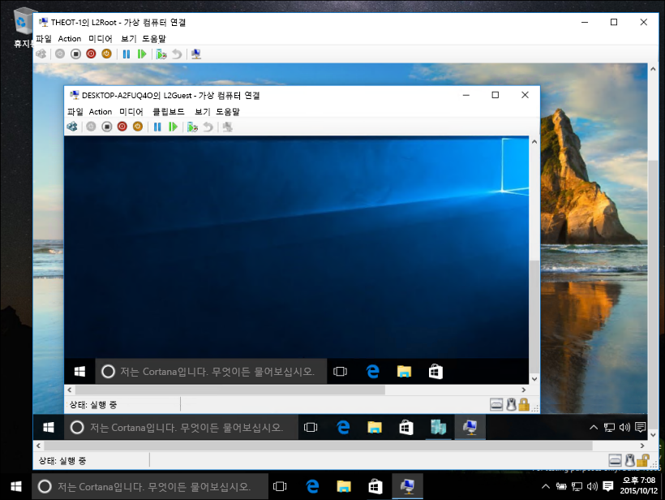
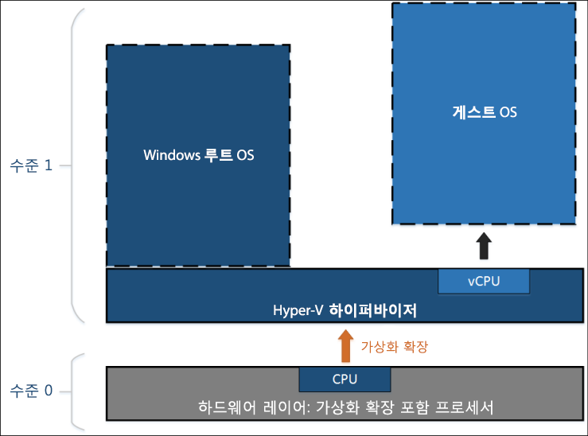
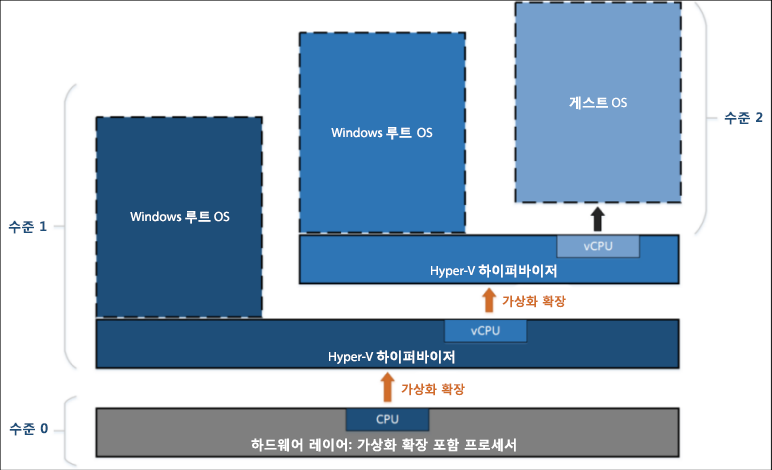

# 중첩된 가상화

> **참고:** 이 초기 미리 보기 기능은 빌드 10565 이상을 실행하는 Windows 사용자에게만 제공되고 성능 또는 안정성 보장 없이 제공됩니다.

중첩된 가상화는 가상화된 환경 내에서 가상화를 실행 중입니다. 즉, 중첩을 사용하면 가상 컴퓨터 내 Hyper-V 서버 역할을 실행할 수 있습니다.



Hyper-V는 가상 컴퓨터를 실행하도록 하드웨어 가상화 지원(예: Intel VT-x 및 AMD-V)을 사용합니다. 일반적으로 Hyper-V가 설치되면 하이퍼바이저는 게스트 가상 컴퓨터에서 이 기능을 숨깁니다. 이는 게스트 가상 컴퓨터에서 다른 하이퍼바이저 간에 Hyper-V 서버 역할 실행을 방지합니다.

중첩된 가상화는 게스트 가상 컴퓨터에 이러한 하드웨어 가상화 지원 구성 요소를 제공합니다.

아래 다이어그램은 중첩 없이 Hyper-V를 보여 줍니다. Hyper-V 하이퍼바이저는 하드웨어 가상화 확장(주황색 화살표)을 전체 제어하며 게스트 운영 체제에 노출하지 않습니다.



반대로 아래 다이어그램은 중첩으로 Hyper-V를 보여 줍니다. 이 경우 Hyper-V는 해당 가상 컴퓨터에 하드웨어 가상화 확장을 제공합니다. 중첩을 활성화하면 게스트 가상 컴퓨터는 자체 하이퍼바이저를 설치하고 자체 게스트 VM을 실행할 수 있습니다.



## 중첩된 가상화 요구 사항

중첩된 가상화를 활성화하기 전에 이것은 미리 보기임을 유의합니다. 프로덕션 환경에서 중첩을 사용하지 마십시오.

요구 사항:
* 4GB RAM을 최소값으로 사용할 수 있습니다. 중첩된 가상화는 충분한 메모리 크기가 필요합니다.
* 두 하이퍼바이저는 최신 Windows Insider 빌드(10565 이상)가 필요합니다. 다른 하이퍼바이저는 작동하지 않습니다.
* 이 기능은 현재 Intel 전용입니다. Intel VT-x가 필요합니다.

## 중첩된 가상화 활성화

1. 호스트로 동일한 빌드를 실행하는 가상 컴퓨터 만들기 -- [여기에 지침이 있습니다](../quick_start/walkthrough_create_vm.md).

2. Hyper-V 호스트에서 관리자 권한으로 [이 스크립트](https://github.com/Microsoft/Virtualization-Documentation/blob/master/hyperv-tools/Nested/Enable-NestedVm.ps1)를 실행합니다.

    이 초기 미리 보기에서는 중첩이 몇 가지 구성 요구 사항과 함께 제공됩니다. 작업을 쉽게 하기 위해 [이 PowerShell 스크립트](https://github.com/Microsoft/Virtualization-Documentation/blob/master/hyperv-tools/Nested/Enable-NestedVm.ps1) 스크립트는 구성을 확인하고 올바르지 않은 것을 변경하고 지정된 가상 컴퓨터에 대한 중첩된 가상화를 활성화합니다.

  ``` PowerShell
  Invoke-WebRequest https://raw.githubusercontent.com/Microsoft/Virtualization-Documentation/master/hyperv-tools/Nested/Enable-NestedVm.ps1 -OutFile ~/Enable-NestedVm.ps1 
  ~/Enable-NestedVm.ps1 -VmName "DemoVM"
  ```

3. 가상 컴퓨터에 Hyper-V를 설치합니다.

  ``` PowerShell
  Invoke-Command -VMName "DemoVM" -ScriptBlock { Enable-WindowsOptionalFeature -FeatureName Microsoft-Hyper-V -Online; Restart-Computer }
  ```

4. 중첩된 가상 컴퓨터를 만듭니다.

## 알려진 문제

다음은 알려진 문제 목록입니다.
* 장치 가드가 활성화된 호스트는 가상화 확장을 게스트에 공개할 수 없습니다.

* 가상화 기반 보안(VBS)이 활성화된 호스트는 가상화 확장을 게스트에 공개할 수 없습니다. 중첩된 가상화를 미리 보려면 VBS를 먼저 비활성화해야 합니다.

* 중첩된 가상화가 가상 컴퓨터에서 활성화되면 다음과 같은 기능을 해당 VM과 더 이상 호환할 수 없습니다.  
    이러한 작업은 다른 가상 컴퓨터를 호스팅하는 경우 실패하거나 가상 컴퓨터를 시작하지 않게 합니다.
    * 동적 메모리는 OFF여야 합니다. 이렇게 하면 VM 부팅을 방지합니다.
    * 런타임 메모리 크기 조정이 실패합니다.
    * 실행 중인 VM에 검사점 적용이 실패합니다.
    * 실시간 마이그레이션이 실패합니다. 즉, 다른 VM을 호스팅하는 VM은 실시간 마이그레이션될 수 없습니다.
    * 저장/복원이 실패합니다.

    > **참고:** 이러한 기능은 "가장 안쪽의" 게스트 VM에서 계속 작동합니다. 제한은 첫 번째 계층 VM에만 적용됩니다.

* 중첩된 가상화가 활성화되면 MAC 스푸핑은 "가장 안쪽의" 게스트에서 작동하도록 네트워킹에 대한 가상 컴퓨터에서 활성화되어야 합니다.

## FAQ 및 문제 해결

### 가상 컴퓨터가 시작되지 않으면 어떻게 해야 합니까?

1. 동적 메모리가 OFF인지 확인합니다.
2. 관리자 권한 프롬프트로 호스트 컴퓨터에서 이 PowerShell 스크립트를 실행합니다.

    이 스크립트는 호스트 및 VM이 중첩에 대해 제대로 구성되었는지 여부를 보고합니다.

  ``` PowerShell
  Invoke-WebRequest https://raw.githubusercontent.com/Microsoft/Virtualization-Documentation/master/hyperv-tools/Nested/Get-NestedVirtStatus.ps1 -OutFile ~/Get-NestedVirtStatus.ps1 
  ~/Get-NestedVirtStatus.ps1
  ```

### 가상 컴퓨터 연결이 손실되었습니다.

빈 암호를 사용하는 경우 알려진 문제입니다. 암호를 변경하고 문제를 해결해야 합니다.

### 내 문제가 여기에 없습니다.

문제가 보이지 않으세요? 피드백이 있습니까? 문의하세요.

Windows 피드백 앱, [가상화 포럼](https://social.technet.microsoft.com/Forums/windowsserver/En-us/home?forum=winserverhyperv) 또는 [GitHub](https://github.com/Microsoft/Virtualization-Documentation)를 통해 보고하세요.


