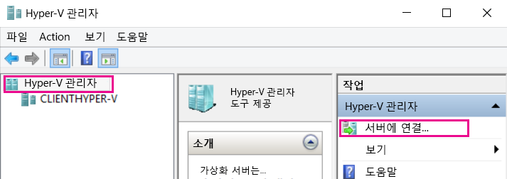
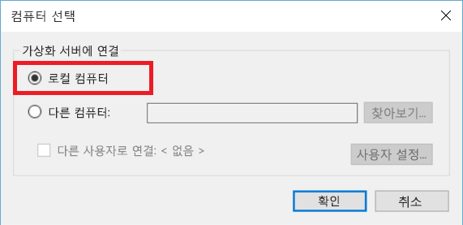
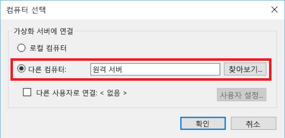
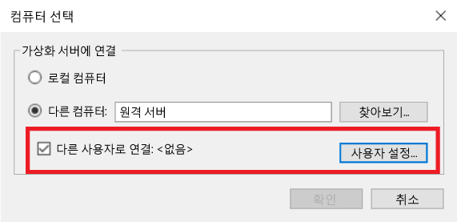

# Hyper-V 관리자로 원격 Hyper-V 호스트 관리

Hyper-V 관리자는 로컬 Hyper-V 호스트 및 적은 수의 원격 호스트를 진단 및 관리하기 위한 기본 도구입니다.  이 문서는 지원되는 모든 구성에서 Hyper-V 관리자를 사용하여 Hyper-V 호스트에 연결하기 위한 구성 단계를 설명합니다.

> Hyper-V 관리자는 [Hyper-V가 설치된 모든 Windows OS](../quick_start/walkthrough_compatibility.md#OperatingSystemRequirements)에서 **Hyper-V 관리 도구**로써 **프로그램 및 기능**을 통해 사용할 수 있습니다.  원격 호스트를 관리하기 위해 Hyper-V 플랫폼을 사용할 필요는 없습니다.

Hyper-V 관리자에서 Hyper-V 호스트에 연결하려면 **Hyper-V 관리자**가 왼쪽 창에서 선택되었는지 확인한 다음 오른쪽 창에서 **서버에 연결...**을 선택합니다.



## Hyper-V 관리자를 사용하여 지원되는 Hyper-V 호스트 조합
Windows 10에서 Hyper-V 관리자를 사용하여 다음과 같은 Hyper-V 호스트를 관리할 수 있습니다.
* Windows 10
* Windows 8.1
* Windows 8
* Windows Server 2016(모든 버전 및 설치 옵션)과 Nano 서버 및 해당하는 버전의 Hyper-V 서버
* Windows Server 2012 R2(모든 버전 및 설치 옵션)와 해당하는 버전의 Hyper-V 서버
* Windows Server 2012(모든 버전 및 설치 옵션)과 해당하는 버전의 Hyper-V 서버

Windows 8.1 및 Windows Server 2012 R2에서 Hyper-V 관리자를 통해 다음 호스트를 관리할 수 있습니다.
* Windows 8.1
* Windows 8
* Windows Server 2012 R2(모든 버전 및 설치 옵션)와 해당하는 버전의 Hyper-V 서버
* Windows Server 2012(모든 버전 및 설치 옵션)과 해당하는 버전의 Hyper-V 서버

Windows 8 및 Windows Server 2012에서 Hyper-V 관리자를 통해 다음 호스트를 관리할 수 있습니다.
* Windows 8
* Windows Server 2012(모든 버전 및 설치 옵션)과 해당하는 버전의 Hyper-V 서버

Windows 7 및 Windows Server 2008 R2에서 Hyper-V 관리자를 통해 다음 호스트를 관리할 수 있습니다.
* Windows Server 2008 R2(모든 버전 및 설치 옵션)와 해당하는 버전의 Hyper-V 서버

Windows Vista 및 Windows Server 2008에서 Hyper-V 관리자를 통해 다음 호스트를 관리할 수 있습니다.
* Windows Server 2008(모든 버전 및 설치 옵션)과 해당하는 버전의 Hyper-V 서버

> **참고:** Hyper-V 관리자 기능은 관리 중인 버전에 대해 사용 가능한 기능과 일치합니다. 즉, Windows Server 2012 R2에서 원격 Windows Server 2012 호스트를 관리하는 경우 Windows Server 2012 R2에서 새 Hyper-V 관리자 기능을 사용할 수 없습니다.

## 로컬 호스트 관리 ##
로컬 호스트를 Hyper-V 호스트로 Hyper-V 관리자에 추가하려면 **컴퓨터 선택** 대화 상자에서 **로컬 컴퓨터**를 선택합니다.



연결을 설정할 수 없는 경우:
*  Hyper-V 플랫폼 역할이 활성화되어 있는지 확인합니다.  
  Hyper-V가 지원되는지 확인하려면 [호환성 확인을 위한 연습 섹션](../quick_start/walkthrough_compatibility.md)을 참조하세요.
*  사용자 계정이 Hyper-V 관리자 그룹의 일부인지 확인합니다.


## 동일한 도메인에서 다른 Hyper-V 호스트 관리 ##

Hyper-V 관리자에 원격 Hyper-V 호스트를 추가하려면 **컴퓨터 선택** 대화 상자에서 **다른 컴퓨터**를 선택하고 텍스트 필드에 원격 호스트의 호스트 이름, NetBIOS 또는 FQDN을 입력합니다.



원격 Hyper-V 호스트를 관리하려면 로컬 컴퓨터와 원격 호스트에서 원격 관리를 활성화해야 합니다.

`System Properties -> Remote Management Settings`을 통해 이 작업을 수행하거나 관리자 권한으로 다음 PowerShell 명령을 실행하여 수행할 수 있습니다.  

``` PowerShell
Enable-PSRemoting
```

현재 사용자 계정이 원격 호스트에서 Hyper-V Administrator 계정과 일치하는 경우 계속 진행하여 **확인**을 눌러 연결합니다.  

> Windows 8 또는 Windows 8.1의 Hyper-V 관리자에서 원격 호스트를 관리하도록 지원되는 유일한 방법입니다.


Windows 10에서는 원격 연결 유형의 가능한 조합을 크게 확장했습니다.  
이제 호스트 이름 또는 IP 주소를 사용하여 원격 Windows 10 이상 호스트에 연결할 수 있습니다.  Hyper-V 관리자는 이제 대체 사용자 자격 증명도 또한 지원합니다.  


### 다른 사용자로 원격 호스트에 연결합니다.
> Windows 10 또는 Windows Server 2016 Technical Preview 3 이상 원격 호스트에 연결하는 경우에만 사용 가능합니다.

Windows 10에서 원격 호스트에 대해 올바른 사용자 계정으로 실행하지 않는 경우 대체 자격 증명을 사용하여 다른 사용자로 연결할 수 있습니다.

원격 Hyper-V 호스트에 대한 자격 증명을 지정하려면 **컴퓨터 선택** 대화 상자에서 **다른 사용자로 연결: **을 선택한 다음 **사용자 설정...**을 선택합니다.




### IP 주소를 사용하여 원격 호스트에 연결
> Windows 10 또는 Windows Server 2016 Technical Preview 3 이상 원격 호스트에 연결하는 경우에만 사용 가능합니다.

경우에 따라 호스트 이름이 아닌 IP 주소를 사용하여 보다 쉽게 연결할 수 있습니다. Windows 10을 사용하면 그렇게 할 수 있습니다.

IP 주소를 사용하여 연결하려면 **다른 컴퓨터** 텍스트 필드에 IP 주소를 입력합니다.


## 도메인 외부에서(또는 도메인 없이) Hyper-V 호스트 관리 ##
> Windows 10 또는 Windows Server 2016 Technical Preview 3 이상 원격 호스트에 연결하는 경우에만 사용 가능합니다.

관리할 Hyper-V 호스트에서 관리자 권한으로 다음을 실행합니다.

1.  [Enable-PSRemoting](https://technet.microsoft.com/en-us/library/hh849694.aspx)
  * [Enable-PSRemoting](https://technet.microsoft.com/en-us/library/hh849694.aspx)은 *개인* 네트워크 영역에 필요한 방화벽 규칙을 만듭니다. 공용 영역에서 이 액세스를 허용하려면 CredSSP 및 WinRM에 대한 규칙을 사용해야 합니다.
2.  [Enable-WSManCredSSP](https://technet.microsoft.com/en-us/library/hh849872.aspx) -역할 서버

관리하는 PC에서 관리자 권한으로 다음을 실행합니다.

1. Set-Item WSMan:\localhost\Client\TrustedHosts -value "fqdn-of-hyper-v-host"
2. [Enable-WSManCredSSP](https://technet.microsoft.com/en-us/library/hh849872.aspx) -Role client -DelegateComputer "fqdn-of-hyper-v-host"
3. 또한 다음 그룹 정책을 구성해야 합니다. ** 컴퓨터 구성 | 관리 템플릿 | 시스템 | 자격 증명 위임 | 서버 인증이 NTLM 전용일 경우 새로운 자격 증명 위임을 허용 **
    * **사용**을 클릭하고 *wsman/fqdn-of-hyper-v-host*를 추가합니다.


<!--HONumber=Sep16_HO3-->


