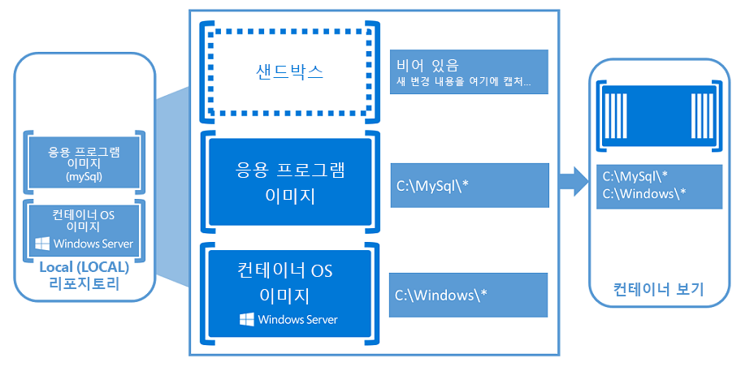

# Windows 컨테이너

응용 프로그램은 클라우드 및 모바일 시대의 혁신을 추진하는 동력이 됩니다. 컨테이너와, 그와 관련한 개발 생태계는 소프트웨어 개발자들이 차세대 응용 프로그램 환경을 조성할 수 있는 힘을 제공합니다.

[Windows 기반 컨테이너: 엔터프라이즈급 컨트롤이 있는 최신 웹 개발](https://youtu.be/Ryx3o0rD5lY)에 대한 간략한 개요를 확인합니다.

## 컨테이너란?

컨테이너는 격리되어 있고 리소스로 제어되며 이식 가능한 운영 체제입니다.

기본적으로, 컨테이너는 응용 프로그램이 시스템의 나머지 부분에 영향을 주지 않고 응용 프로그램에 영향을 미치는 시스템 없이 실행할 수 있는 격리된 위치입니다. 컨테이너는 가상화의 다음 발전 단계입니다.

컨테이너 안에 있다면 방금 설치한 물리적 컴퓨터나 가상 컴퓨터 안에 있는 것과 매우 유사할 것입니다. 또한 Windows Server 컨테이너인 [Docker](https://www.docker.com/)를 다른 컨테이너와 같은 방식으로 관리할 수 있습니다.

## Windows 컨테이너

Windows 컨테이너는 두 개의 서로 다른 컨테이너 형식 또는 런타임을 포함합니다.

**Windows Server 컨테이너** – 프로세스 및 네임스페이스 격리 기술을 통해 응용 프로그램 격리 기능을 제공합니다. Windows Server 컨테이너는 컨테이너 호스트와 호스트에서 실행되는 모든 컨테이너와 커널을 공유합니다.

**Hyper-v 컨테이너** – 고도로 최적화된 가상 컴퓨터에서 각 컨테이너를 실행하여 Windows Server 컨테이너에서 제공하는 격리를 확장합니다. 이 구성에서 컨테이너 호스트의 커널은 Hyper-V 컨테이너와 공유되지 않습니다.

## 컨테이너의 기본 사항

컨테이너 작업을 시작하고 나면 컨테이너와 가상 컴퓨터 사이에 유사한 부분이 많음을 알게 될 것입니다. 컨테이너는 운영 체제를 실행하며, 파일 시스템을 보유하고, 물리적 또는 가상 컴퓨터 시스템과 마찬가지로 네트워크에서 액세스할 수 있습니다. 그렇긴 하지만 컨테이너의 바탕이 되는 기술 및 개념은 가상 컴퓨터와는 상당한 차이가 있습니다.

Mark Russinovich의 [이 블로그 게시물](http://azure.microsoft.com/blog/2015/08/17/containers-docker-windows-and-trends/)에서는 컨테이너도 설명합니다.

Windows 컨테이너의 만들기 및 작업을 시작할 때 다음 주요 개념이 유용할 것입니다.

**컨테이너 호스트:** Windows 컨테이너 기능을 통해 구성된 물리적 또는 가상 커퓨터 시스템입니다. 컨테이너 호스트는 하나 이상의 Windows 컨테이너를 실행합니다.

**컨테이너 이미지:** 샌드박스에서 캡처한 소프트웨어 설치 등 컨테이너 파일 시스템이나 레지스트리에 대한 수정 내용입니다. 대부분의 경우 이러한 변경 내용을 상속하여 새 컨테이너를 만들 수 있게 이 상태를 캡처하고자 할 수 있습니다. 그것이 바로 이미지입니다. 컨테이너가 중지되면 해당 샌드박스를 취소하거나 새 컨테이너 이미지로 변환할 수 있습니다. 예를 들어 Windows Server Core OS 이미지에서 컨테이너를 배포했다고 가정해 보겠습니다. 그런 다음 컨테이너에 MySQL을 설치합니다. 이 컨테이너의 배포 가능한 버전 역할을 하도록 이 컨테이너에서 새 이미지를 만듭니다. 이 이미지는 수행한 변경 내용 (MySQL)만 포함하지만 컨테이너 OS 이미지 위에서 계층으로 작동하게 됩니다.

**샌드박스:** 컨테이너가 시작되면 파일 시스템 수정, 레지스트리 수정 또는 소프트웨어 설치 등과 같은 모든 쓰기 작업이 이 '샌드박스' 계층에 캡처됩니다.

**컨테이너 OS 이미지:** 컨테이너가 이미지에서 배포됩니다. 컨테이너 OS 이미지는 컨테이너를 구성하는 잠재적으로 많은 이미지 계층에서 첫 번째 계층입니다. 이 이미지는 운영 체제 환경을 제공합니다. 컨테이너 OS 이미지는 변경하거나 수정할 수 없습니다.

**컨테이너 저장소:** 컨테이너 이미지가 만들어질 때마다 컨테이너 이미지와 해당 종속성이 로컬 저장소에 저장됩니다. 이러한 이미지는 컨테이너 호스트에서 여러 번 다시 사용할 수 있습니다. 컨테이너 이미지를 공용 또는 개인 레지스트리(예: DockerHub)에 저장하여 여러 다른 컨테이너 호스트에서 사용할 수도 있습니다.

**컨테이너 관리 기술:** PowerShell 및 Docker를 모두 사용하여 Windows 컨테이너를 관리할 수 있습니다. 이러한 도구를 사용하여 새 컨테이너와 컨테이너 이미지를 만들고 컨테이너 수명 주기를 관리할 수 있습니다.

## 개발자를 위한 컨테이너

개발자의 데스크톱에서 테스트 컴퓨터와 여러 프러덕션 컴퓨터에 이르기까지, 몇 초 만에 모든 환경 전체에 동일하게 배포되는 Docker 이미지를 만들 수 있습니다.  이 덕분에 Docker가 관리하는 컨테이너화된 공개 응용 프로그램 레지스트리인 DockerHub를 통해, Docker 컨테이너 안에 패키징된 응용 프로그램의 거대한 생태계가 탄생했으며 지속적으로 확장되고 있습니다. 현재 공개 커뮤니티 리포지토리에 180,000개 이상의 응용 프로그램이 게시되어 있습니다.

앱을 컨테이너화할 때는 앱과, 해당 앱을 실행하는 데 필요한 구성 요소만 "이미지"로 결합됩니다. 그런 다음 이 이미지를 통해 필요할 때 컨테이너가 만들어집니다. 이미지를 기반으로 다른 이미지를 만들 수도 있으므로 이미지 만들기 작업이 매우 신속해집니다. 여러 컨테이너가 동일한 이미지를 공유할 수 있습니다. 즉 컨테이너가 매우 신속하게 시작되고 더 적은 리소스를 사용합니다. 예를 들어, 앱 분산과 각 서비스의 개별적이고 긴속한 확장을 위해 컨테이너를 사용하여 가볍고 이식 가능한 앱 구성 요소 또는 '마이크로 서비스'를 유도할 수 있습니다.

컨테이너는 응용 프로그램의 실행에 필요한 모든 것을 담고 있으므로 이식성이 높으며 Windows Server 2016을 실행하는 모든 시스템에서 실행할 수 있습니다. 로컬로 컨테이너를 만들고 테스트한 다음 동일한 컨테이너 이미지를 회사의 사설 클라우드, 공용 클라우드 또는 서비스 공급자에 배포할 수 있습니다. 컨테이너는 근본적으로 민첩하기 때문에 가상화된 대규모 클라우드 환경에서의 최신 앱 개발을 지원합니다.

개발자들은 컨테이너를 통해 어느 언어로나 앱을 구축할 수 있습니다. 이러한 앱은 완전히 이식 가능하며 랩톱, 데스크톱, 서버, 사설 클라우드, 공용 클라우드 또는 서비스 공급자 등, 코드 변경 없이 어디서나 실행할 수 있습니다.

컨테이너는 개발자가 더 품질 높은 응용 프로그램을 더 신속하게 구축하여 제공하는 데 도움이 됩니다.

## IT 전문가 위한 컨테이너

IT 전문가들은 컨테이너를 사용하여 개발, QA, 프러덕션 팀에 표준화된 환경을 제공할 수 있습니다. 복잡한 설치와 구성 절차에 대해 더 이상 걱정할 것이 없습니다. 시스템 관리자들은 컨테이너를 사용하여 OS 설치와 기반 인프라에서의 차이점을 골라낼 수 있습니다.

컨테이너는 관리자들이 업데이트와 유지 관리가 더 간단한 인프라를 만드는 데 도움이 됩니다.

## 비디오 개요

<iframe 
src="https://channel9.msdn.com/Blogs/containers/Containers-101-with-Microsoft-and-Docker/player#ccLang=ko" width="800" height="450" allowFullScreen="true" frameBorder="0" scrolling="no"></iframe>

## Windows Server 컨테이너 사용해 보기

[Windows Azure에서 Windows 컨테이너 시작](../quick_start/azure_setup.md)  
[로컬로 Windows 컨테이너 시작](../quick_start/container_setup.md)

