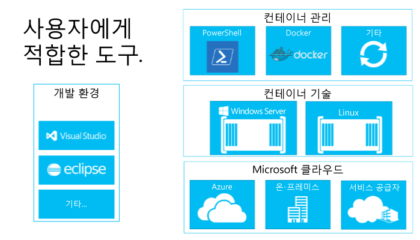

# 컨테이너 생태계 구축

컨테이너 생태계를 구축하는 것이 왜 그렇게 중요한지 이해하기 위해 먼저 Docker에 대해 살펴보겠습니다.

## Docker의 효과

컨테이너 개념(네임스페이 격리 및 리소스 관리)은 BSD Jails, Solaris Zones 및 UNIX chroot(루트 변경) 메커니즘으로 거슬러 올라가 오래 전부터 사용되었습니다.   Docker의 역할은 공통 도구 집합, 패키징 모델, 배포 메커니즘을 제공하는 것입니다.  이를 통해 Docker는 응용 프로그램의 컨테이너화와 배포를 크게 간소화합니다.  그러면 이러한 응용 프로그램이 Linux 호스트의 어느 위치에서나 Windows에서 기능을 실행할 수 있습니다.

이렇게 어디에서나 사용 가능한 기술은 모든 호스트에서 동일한 관리 명령을 제공함으로써 관리를 간소화할 뿐 아니라 원할한 DevOps를 위한 고유한 기회를 창출합니다.

개발자의 데스크톱에서 테스트 컴퓨터와 여러 프러덕션 컴퓨터에 이르기까지, 몇 초 만에 모든 환경 전체에 동일하게 배포되는 Docker 이미지를 만들 수 있습니다.  이 덕분에 Docker가 관리하는 컨테이너화된 공개 응용 프로그램 레지스트리인 DockerHub를 통해, Docker 컨테이너 안에 패키징된 응용 프로그램의 거대한 생태계가 탄생했으며 지속적으로 확장되고 있습니다. 

Docker는 개발을 위한 훌륭한 토대가 됩니다.

이제 이러한 응용 프로그램 생태계와, Docker 개념을 바탕으로 자신의 요구에 부합하는 개발 및 배포 워크플로를 만드는 방법에 대해 살펴보겠습니다.

## 컨테이너 생태계의 구성 요소

Windows 컨테이너는 대규모 컨테이너 생태계의 핵심 구성 요소입니다. 전 업계에 걸친 협력을 통해 개발자들에게 각 계층의 솔루션 스택에서 옵션을 제공하고 있습니다.

이러한 컨테이너 생태계는 컨테이너를 관리 및 공유하며 컨테이너에서 실행되는 앱을 개발하는 방법을 제공합니다.

Microsoft는 개발자들이 차세대 앱을 개발하는 데 있어 선택의 폭을 넓히고 생산성을 증대하고자 합니다.  Microsoft의 목표는 개발자들에게 생산성을 위한 동력을 제공하는 것입니다. 즉 코드 수정, 재작성 또는 재구성 없이도 모든 Microsoft 클라우드에 부합하는 응용 프로그램을 말합니다.

Microsoft는 친화적인 개방형 생태계를 조성하기 위해 최선을 다하고 있습니다.  Windows 및 Linux 등, 이해 당사자인 다양한 개발자 생태계를 하나로 모아 혁신을 추구하기 위해 적극적으로 지원하고 있습니다.

향후 몇 개월 동안 이 개발 생태계에서의 추가적인 파트너에 대해 자세한 정보를 제공할 것입니다.

<!--HONumber=Jun16_HO4-->

