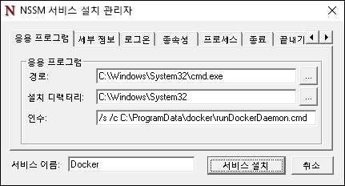
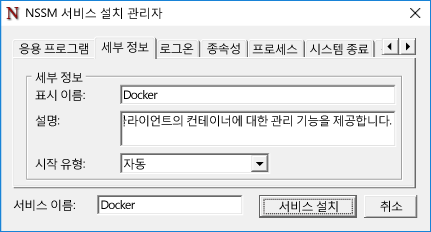
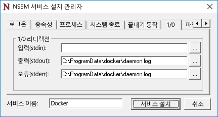

# Docker 및 Windows

**이 예비 콘텐츠는 변경될 수 있습니다.**

Docker는 컨테이너 배포 및 관리 플랫폼으로, Windows와 Linux 컨테이너 모두에서 작동합니다. Docker는 컨테이너와 컨테이너 이미지를 만들고 관리하며 삭제하는 데 사용됩니다. Docker를 통해 컨테이너 이미지를 공용 레지스트리(Docker 허브)와 사설 레지스트리(Docker 신뢰 레지스트리)에 저장할 수 있습니다. 또한 Docker는 Docker Swarm을 통한 컨테이너 호스트 클러스터링 기능과 Docker Compose를 통한 배포 자동화를 제공합니다. Docker 및 Docker 도구 집합에 대한 자세한 내용은 [Docker.com](https://www.docker.com/)에서 확인하세요.

> Windows Server 및 Hyper-V 컨테이너를 만들고 관리하는 데 Docker를 사용하려면 먼저 Windows 컨테이너 기능을 활성화해야 합니다. 이 기능을 사용하도록 설정하기 위한 지침은 [컨테이너 호스트 배포 가이드](./docker_windows.md)를 참조하세요.

## Windows Server

### Docker 설치

Docker 데몬 및 CLI는 Windows Server 또는 Windows Server Core와 함께 제공되지 않으며 Windows 컨테이너 기능과 함께 설치되지 않습니다. Docker는 별도로 설치해야 합니다. 이 문서에서는 Docker 디먼 및 Docker 클라이언트를 수동으로 설치하는 방법을 설명합니다. 이 작업을 완료하기 위한 자동화된 방법도 제공합니다.

Docker 디몬 및 Docker 명령줄 인터페이스는 Go 언어로 개발되었습니다. 현재 docker.exe는 Windows 서비스형태로 설치되지 않습니다. Windows 서비스를 만드는 데 몇 가지 방법을 사용할 수 있습니다. 여기에서 `nssm.exe`를 사용한 것을 보여주는 한 예입니다.

`https://aka.ms/tp4/docker`에서 docker.exe를 다운로드하여 컨테이너 호스트의 System32 디렉터리에 배치합니다.

```powershell
PS C:\> wget https://aka.ms/tp4/docker -OutFile $env:SystemRoot\system32\docker.exe
```

이름이 `c:\programdata\docker`인 디렉터리를 만듭니다. 이 디렉터리에서 이름이 `runDockerDaemon.cmd`인 파일을 만듭니다.

```powershell
PS C:\> New-Item -ItemType File -Path C:\ProgramData\Docker\runDockerDaemon.cmd -Force
```

다음 텍스트를 `runDockerDaemon.cmd` 파일에 복사합니다. 이 배치 파일은 `docker daemon -D -b “Virtual Switch”` 명령으로 Docker 디먼을 시작합니다. 참고: 이 파일에서 가상 스위치의 이름은 네트워크 연결에 컨테이너를 사용할 가상 스위치의 이름과 일치해야 합니다.

```powershell
@echo off
set certs=%ProgramData%\docker\certs.d

if exist %ProgramData%\docker (goto :run)
mkdir %ProgramData%\docker

:run
if exist %certs%\server-cert.pem (goto :secure)

docker daemon -D -b "Virtual Switch"
goto :eof

:secure
docker daemon -D -b "Virtual Switch" -H 0.0.0.0:2376 --tlsverify --tlscacert=%certs%\ca.pem --tlscert=%certs%\server-cert.pem --tlskey=%certs%\server-key.pem
```
[https://nssm.cc/release/nssm-2.24.zip](https://nssm.cc/release/nssm-2.24.zip)에서 nssm.exe를 다운로드합니다.

```powershell
PS C:\> wget https://nssm.cc/release/nssm-2.24.zip -OutFile $env:ALLUSERSPROFILE\nssm.zip
```

파일의 압축을 풀고 `nssm-2.24\win64\nssm.exe`를 `c:\windows\system32` 디렉터리에 복사합니다.

```powershell
PS C:\> Expand-Archive -Path $env:ALLUSERSPROFILE\nssm.zip $env:ALLUSERSPROFILE
PS C:\> Copy-Item $env:ALLUSERSPROFILE\nssm-2.24\win64\nssm.exe $env:SystemRoot\system32
```
`nssm install`을 실행하여 Docker 서비스를 구성합니다.

```powershell
PS C:\> start-process nssm install
```

NSSM 서비스 설치 관리자의 해당 필드에 다음 데이터를 입력합니다.

응용 프로그램 탭:

- **경로:** C:\Windows\System32\cmd.exe

- **시작 디렉터리:** C:\Windows\System32

- **인수:** /s /c C:\ProgramData\docker\runDockerDaemon.cmd < nul

- **서비스 이름** - Docker



세부 정보 탭:

- **표시 이름:** Docker

- **설명:** Docker 디먼은 Docker 클라이언트의 컨테이너에 대한 관리 기능을 제공합니다.




IO 탭:

- **출력(stdout):** C:\ProgramData\docker\daemon.log

- **오류(stderr):** C:\ProgramData\docker\daemon.log




완료되면 `서비스 설치` 단추를 클릭합니다.

이 작업이 완료되어 Windows가 시작되면 Docker 디먼(서비스)도 시작됩니다.

### Docker 제거

이 가이드를 따라 docker.exe에서 Windows 서비스를 만든 경우 다음 명령으로 서비스를 제거합니다.

```powershell
PS C:\> sc.exe delete Docker

[SC] DeleteService SUCESS
```

## Nano Server

### Docker 설치

`https://aka.ms/tp4/docker`에서 docker.exe를 다운로드하여 Nano Server 컨테이너 호스트의 `windows\system32` 폴더에 복사합니다.

다음 명령을 실행하여 Docker 디먼을 시작합니다. 컨테이너 호스트를 실행할 때마다 이 명령을 실행해야 합니다. 이 명령은 Docker 디먼을 시작하고, 컨테이너 연결을 위한 가상 스위치를 지정하며, 들어오는 Docker 요청을 포트 2375에서 수신하도록 디먼을 지정합니다. 이 구성에서는 Docker를 원격 컴퓨터에서 관리할 수 있습니다.

```powershell
PS C:\> start-process cmd "/k docker daemon -D -b <Switch Name> -H 0.0.0.0:2375”
```

### Docker 제거

Docker 디먼 및 클라이언트를 Nano Server에서 제거하려면 `docker.exe`를 Windows\system32 디렉터리에서 제거합니다.

```powershell
PS C:\> Remove-Item $env:SystemRoot\system32\docker.exe
```

### 대화형 Nano 세션

> Nano 서버를 원격으로 관리하는 방법에 대한 자세한 내용은 [Getting Started with Nano Server(Nano 서버 시작)](https://technet.microsoft.com/en-us/library/mt126167.aspx#bkmk_ManageRemote)를 참조하세요.

Nano Server 호스트에서 컨테이너를 대화형으로 관리하는 경우 이 오류가 표시될 수 있습니다.

```powershell
docker : cannot enable tty mode on non tty input
+ CategoryInfo          : NotSpecified: (cannot enable tty mode on non tty input:String) [], RemoteException
+ FullyQualifiedErrorId : NativeCommandError 
```

이 오류는 대화형 세션이 있는 컨테이너를 -it를 사용하여 실행하려고 할 때 발생할 수 있습니다.

```powershell
Docker run -it <image> <command>
```
또는 실행 중인 컨테이너에 연결하려고 할 때도 발생할 수 있습니다.

```powershell
Docker attach <container name>
```

Nano Server 호스트에서 Docker 생성 컨테이너를 사용하여 대화형 세션을 만들려면 Docker 디먼을 원격으로 관리해야 합니다. 이렇게 하려면 [이 위치](https://aka.ms/ContainerTools)에서 docker.exe를 다운로드하여 원격 시스템에 복사합니다.

먼저 Nano Server에서 원격 명령을 수신할 Docker 디먼을 설정해야 합니다. 이렇게 하려면 Nano Server에서 다음 명령을 실행합니다.

```powershell
docker daemon -D -H <ip address of Nano Server>:2375
```

이제 컴퓨터에서 PowerShell 또는 CMD 세션을 열고 `-H`에 원격 호스트를 지정하여 Docker 명령을 실행합니다.

```powershell
.\docker.exe -H tcp://<ip address of Nano Server>:2375
```

예를 들어 사용 가능한 이미지를 보려면 다음과 같이 합니다.

```powershell
.\docker.exe -H tcp://<ip address of Nano Server>:2375 images
```


<!--HONumber=Feb16_HO4-->


