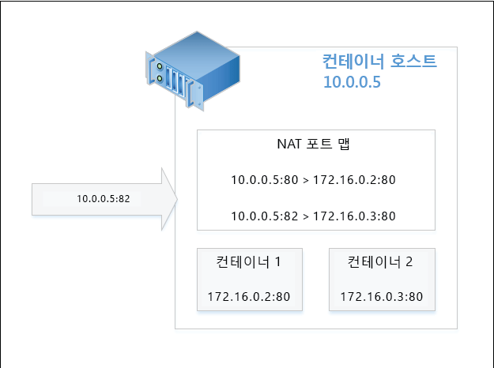
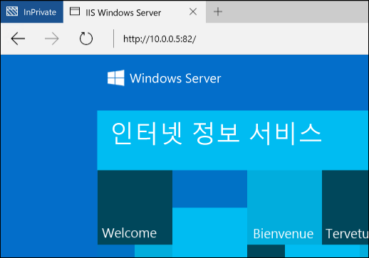

# 컨테이너 네트워킹

**이 예비 콘텐츠는 변경될 수 있습니다.** 

Windows 컨테이너는 네트워킹에 관해서 가상 컴퓨터와 유사하게 작동합니다. 각 컨테이너에는 가상 네트워크 어댑터가 있고 이것은 가상 스위치에 연결되며 이를 통해 인바운드 및 아웃바운드 트래픽이 전달됩니다. 동일한 호스트에서 컨테이너 간에 격리를 적용하려면 컨테이너에 대한 네트워크 어댑터가 설치되는 각 Windows Server 및 Hyper-V 컨테이너에 대해 네트워크 구획을 만듭니다. Windows Server 컨테이너는 호스트 vNIC를 사용하여 가상 스위치에 연결합니다. Hyper-V 컨테이너는 가상 VM NIC(유틸리티 VM에 노출되지 않음)를 사용하여 가상 스위치에 연결합니다.

Windows 컨테이너는 4개의 다른 네트워킹 모드를 지원합니다.

- **Network Address Translation 모드** – 각 컨테이너가 내부 가상 스위치에 연결되고 WinNAT를 사용하여 개인 IP 서브넷에 연결합니다. WinNAT는 컨테이너 호스트와 컨테이너 자체 간에 NAT(Network Address Translation)와 PAT(포트 주소 변환)를 수행합니다.

- **투명 모드** – 각 컨테이너는 외부 가상 스위치에 연결되고 실제 네트워크에 직접 연결됩니다. IP는 외부 DHCP 서버를 사용하여 정적으로나 동적으로 할당할 수 있습니다. 원시 컨테이너 네트워크 트래픽 프레임은 주소 변환 없이 실제 네트워크에 직접 배치됩니다.

- **L2 브리지 모드** - 각 컨테이너는 외부 가상 스위치에 연결됩니다. 동일한 IP 서브넷에 있고 동일한 컨테이너 호스트에 연결된 두 컨테이너 간의 네트워크 트래픽은 직접 브리지됩니다. 다른 IP 서브넷에 있거나 다른 컨테이너 호스트에 연결된 두 컨테이너 간의 네트워크 트래픽은 외부 가상 스위치를 통해 전송됩니다. 송신 시 컨테이너에서 시작되는 네트워크 트래픽은 원본 MAC 주소를 컨테이너 호스트의 MAC 주소로 다시 작성해야 합니다. 수신 시 컨테이너를 대상으로 하는 네트워크 트래픽은 대상 MAC 주소를 컨테이너 자체의 MAC 주소로 다시 작성해야 합니다.

- **L2 터널 모드** - *이 모드는 Microsoft 클라우드 스택에서만 사용되어야 합니다*. L2 브리지 모드와 마찬가지로 각 컨테이너는 송신 및 수신 시 다시 작성된 MAC 주소를 사용하여 외부 가상 스위치에 연결됩니다. 그러나 모든 컨테이너 네트워크 트래픽은 계층 2 연결에 관계없이 물리적 호스트의 가상 스위치에 전달됩니다. 따라서 상위 수준의 네트워킹 스택(예: 네트워크 컨트롤러 또는 네트워크 리소스 공급자)에서 프로그래밍된 대로 물리적 호스트의 가상 스위치에 네트워크 정책을 적용할 수 있습니다.

이 문서는 각각의 모드에 대한 이점과 구성을 자세히 설명합니다.

## 네트워크 만들기

### 개요

PowerShell 또는 Docker를 사용하여 컨테이너 네트워크를 만들고, 컨테이너를 네트워크에 연결하고, 포트 전달 규칙을 설정할 수 있습니다. 또한 Docker의 CNM(클라우드 네트워크 모델)을 기반으로 한 Docker 네트워킹 명령을 중점적으로 살펴봅니다.

Docker 네트워크 만들기에 허용되는 드라이버 목록은 ‘투명’, ‘nat’ 및 ‘l2bridge’입니다. 앞에서 설명한 대로 L2 터널 드라이버는 Microsoft Azure 공용 클라우드 배포 시나리오에만 사용해야 합니다. 

> Docker 네트워크 드라이버는 모두 소문자입니다.

Docker 디먼은 네트워크를 만드는 데 사용되는 드라이버의 이름에 따라 다른 네트워킹 모드를 나타냅니다. 예를 들어 NAT 네트워킹 모드에는 nat라는 해당 Docker 네트워크 드라이버가 있습니다. 기본적으로 Windows의 Docker 엔진은 nat 드라이버를 사용하는 네트워크를 찾습니다. NAT 네트워크가 없을 경우 Docker 엔진에서 만듭니다. 만들어진 모든 컨테이너는 기본적으로 nat 네트워크에 연결됩니다.

기본적으로 NAT 네트워크 드라이버를 사용하는 이 동작은 Docker 디먼 엔진을 시작할 때 -b none 옵션을 사용하여 "none"이라는 특정 “브리지”를 지정하는 방식으로 재정의할 수 있습니다.

서비스를 중지하려면 다음 PowerShell 명령을 사용합니다.

```none
Stop-Service docker
```

구성 파일은 `c:\programdata\docker\runDockerDaemon.cmd`에 있습니다. 다음 줄을 편집하고 다음 명령을 추가합니다. `-b "none"`

```none
dockerd -b "none"
```

서비스를 다시 시작합니다.

```none
Start-Service docker
```

'-b "none"'을 사용하여 Docker 디먼을 실행하면 컨테이너 만들기/시작 중에 특정 네트워크를 만들고 참조해야 합니다.

호스트에서 사용할 수 있는 컨테이너 네트워크를 나열하려면 다음 Docker 또는 PowerShell 명령을 사용합니다.

```none
docker network ls
```
그러면 다음과 같이 출력됩니다.

```none
NETWORK ID          NAME                DRIVER
bd8b691a8286        nat                 nat
7b055c7ed373        none                null
```
또는 PowerShell에서는 다음과 같습니다.


```none
Get-ContainerNetwork |fl
```

그러면 다음과 같이 출력됩니다.

```none
Name               : nat
SubnetPrefix       : {172.16.0.0/12}
Gateways           : {172.16.0.1}
Id                 : 67ea1851-326d-408b-a5ef-7dcdb15c4438
Mode               : NAT
NetworkAdapterName :
SourceMac          :
DNSServers         : {10.222.118.22, 10.221.228.12, 10.222.114.67}
DNSSuffix          : corp.microsoft.com
IsDeleted          : False
```

> PowerShell에서 네트워킹 모드 이름은 대/소문자 구분하지 않습니다.


### NAT 네트워킹

**Network Address Translation** – 이 네트워킹 모드는 컨테이너에 개인 IP 주소를 신속하게 할당하는 데 유용합니다. 컨테이너에 대한 외부 액세스는 외부 IP 주소와 포트(컨테이너 호스트) 간 및 내부 IP 주소와 컨테이너의 포트 간 포트 매핑을 통해 제공됩니다. 외부 IP 주소/포트 콤보에서 수신되는 모든 네트워크 트래픽은 WinNAT 포트 매핑 테이블과 비교되어 올바른 컨테이너 IP 주소 및 포트로 전달됩니다. 또한 NAT를 사용하면 여러 컨테이너에서 동일한(내부) 통신 포트가 필요할 수 있는 응용 프로그램을 고유한 외부 포트에 매핑하여 호스트할 수 있습니다. TP5에서는 NAT 네트워크가 하나만 있을 수 있습니다.

> TP5에서는 모든 NAT 정적 포트 매핑을 위해 방화벽 규칙이 자동으로 만들어집니다. 이 방화벽 규칙은 컨테이너 호스트 전체에 적용되며 특정 컨테이너 끝점이나 네트워크 어댑터로 지역화되지 않습니다.

#### 호스트 구성 <!--1-->

NAT 네트워킹 모드를 사용하려면 드라이버 이름 'nat'를 사용하여 컨테이너 네트워크를 만듭니다.

```none
docker network create -d nat MyNatNetwork
```

게이트웨이 IP 주소(--gateway=<string[]>) 및 서브넷 접두사(--subnet=<string[]>)와 같은 추가 매개 변수는 Docker 네트워크 만들기 명령에 추가할 수 있습니다. 자세한 내용은 아래를 참조하세요.

PowerShell을 사용하여 NAT 네트워크를 만들려면 다음 구문을 사용합니다. DNSServers 및 DNSSuffix를 비롯한 추가 매개 변수는 PowerShell을 사용하여 지정할 수 있습니다. 지정하지 않을 경우 이러한 설정은 컨테이너 호스트에서 상속됩니다.

```none
New-ContainerNetwork -Name MyNatNetwork -Mode NAT -SubnetPrefix "172.16.0.0/12" [-GatewayAddress <address>] [-DNSServers <address>] [-DNSSuffix <string>]
```

### 투명 네트워킹

**투명 한 네트워킹** – 이 네트워킹 모드는 컨테이너와 실제 네트워크 간에 직접 연결이 필요한 매우 작업은 배포에서만 사용되어야 합니다. 이 구성에서는 컨테이너에서 실행되는 모든 네트워크 서비스를 실제 네트워크에서 직접 액세스할 수 있습니다. IP 주소는 실제 네트워크의 IP 서브넷 접두사 내에 있다고 가정하여 정적으로 할당할 수 있으며, 실제 네트워크의 다른 IP와 충돌하지 않습니다. 또한 IP 주소는 실제 네트워크의 외부 DHCP 서버에서 동적으로 할당할 수 있습니다. DHCP가 IP 할당에 사용되지 않을 경우 게이트웨이 IP 주소를 지정할 수 있습니다. 

#### 호스트 구성 <!--2-->

투명 네트워킹 모드를 사용하려면 드라이버 이름 '투명'을 사용하여 컨테이너 네트워크를 만듭니다. 

```none
docker network create -d transparent MyTransparentNetwork
```

이 예제에서는 투명 네트워크를 만들고 게이트웨이를 할당합니다.

```none
docker network create -d transparent --gateway=10.50.34.1 "MyTransparentNet"
```

PowerShell 명령은 다음과 유사합니다.

```none
New-ContainerNetwork -Name MyTransparentNet -Mode Transparent -NetworkAdapterName "Ethernet"
```

컨테이너 호스트가 가상화되는 경우 IP 할당에 DHCP를 사용하려면 가상 컴퓨터 네트워크 어댑터에서 MACAddressSpoofing을 사용하도록 설정해야 합니다.

```none
Get-VMNetworkAdapter -VMName ContainerHostVM | Set-VMNetworkAdapter -MacAddressSpoofing On
```

### L2 브리지 네트워킹

**L2 브리지 네트워킹** - 이 구성에서는 컨테이너 호스트의 VFP(가상 필터링 플랫폼) vSwitch 확장이 브리지 역할을 하고 필요에 따라 계층 2 주소 변환(MAC 주소 다시 작성)을 수행합니다. 계층 3 IP 주소 및 계층 4 포트는 변경되지 않습니다. IP 주소는 실제 네트워크의 IP 서브넷 접두사와 대응하여 정적으로 할당하거나, Microsoft 사설 클라우드 배포를 사용하는 경우 가상 네트워크 서브넷 접두사의 IP와 대응하여 할당할 수 있습니다.

#### 호스트 구성 <!--3-->

L2 브리지 네트워킹 모드를 사용하려면 드라이버 이름 'l2bridge'를 사용하여 컨테이너 네트워크를 만듭니다. L2Bridge 네트워크를 만들 때 서브넷과 게이트웨이도 지정해야 합니다.

```none
docker network create -d l2bridge --subnet=192.168.1.0/24 --gateway=192.168.1.1 MyBridgeNetwork
```

PowerShell 명령은 다음과 유사합니다.

```none
New-ContainerNetwork -Name MyBridgeNetwork -Mode L2Bridge -NetworkAdapterName "Ethernet"
```

## 네트워크 제거

`docker network rm`을 사용하여 컨테이너 네트워크를 삭제합니다.

```none
docker network rm "<network name>"
```
또는 PowerShell에서 `Remove-ContainerNetwork`를 사용합니다.

PowerShell 사용
```
Remove-ContainerNetwork -Name <network name>
```

컨테이너 네트워크에서 사용한 Hyper-V 가상 스위치를 정리하고 nat 컨테이너 네트워크에 대해 만들어진 모든 Network Address Translation 개체도 정리합니다.

## 네트워크 옵션

컨테이너 네트워크를 만들거나 컨테이너 자체를 만들 때 다양한 Docker 네트워킹 옵션을 지정할 수 있습니다. 네트워킹 모드를 지정하는 -d (--driver=<network mode>) 옵션 외에 --gateway, --subnet 및 -o 옵션도 컨테이너 네트워크를 만들 때 지원됩니다.

### 추가 옵션

게이트웨이 IP 주소는 `--gateway`를 사용하여 지정할 수 있습니다. 이 작업은 정적으로 할당된 IP 할당(투명 네트워크)을 사용하는 경우에만 완료해야 합니다.

```none
docker network create -d transparent --gateway=10.50.34.1 "MyTransparentNet"
```

IP 서브넷 접두사는 `--subnet`을 사용하여 지정할 수 있으며, IP 주소가 할당될 네트워크 세그먼트를 제어합니다.

```none
docker network create -d nat --subnet=192.168.0.0/24 "MyCustomNatNetwork"
```
-o (--opt=map[]) 매개 변수를 사용하면 Docker를 통해 컨테이너 네트워크를 추가로 사용자 지정할 수 있습니다. 

컨테이너 호스트에서 투명, L2Bridge 또는 L2 터널 네트워크에 사용할 네트워크 어댑터를 지정하려면 *com.docker.network.windowsshim.interface* 옵션을 지정합니다. 
```none
docker network create -d transparent -o com.docker.network.windowsshim.interface="Ethernet 2" "TransparentNetTwo"
```

> PowerShell을 통해 만드는 컨테이너 네트워크는 Docker 디먼이 다시 시작된 다음에야 Docker에서 사용할 수 있습니다. PowerShell 통해 컨테이너 네트워크를 변경하는 경우에도 Docker 디먼을 다시 시작해야 합니다.

### 여러 컨테이너 네트워크

여러 컨테이너 네트워크를 단일 컨테이너 호스트에서 만들 수 있으며, 다음 사항에 주의해야 합니다.
* 컨테이너 호스트당 하나의 NAT 네트워크만 만들 수 있습니다.
* 연결에 외부 vSwitch를 사용하는 여러 네트워크(예: 투명, L2 브리지, L2 투명)는 각각 고유한 네트워크 어댑터를 사용해야 합니다.
* 네트워크에 따라 다른 vSwitch를 사용해야 합니다.

### 네트워크 선택

Windows 컨테이너를 만들 때 컨테이너 네트워크 어댑터가 연결될 네트워크를 지정할 수 있습니다. 네트워크를 지정하지 않을 경우 기본 NAT 네트워크가 사용됩니다.

컨테이너를 기본이 아닌 NAT 네트워크에 연결하려는 경우 또는 -b "none"이 사용 중인 경우 Docker run 명령에서 --net 옵션을 사용합니다.

```none
docker run -it --net=MyTransparentNet windowsservercore cmd
```

### 고정 IP 주소입니다.

고정 IP 주소는 컨테이너 네트워크 어댑터에서 설정되며, NAT, 투명 및 L2Bridge 네트워킹 모드에서만 지원됩니다. 또한 고정 IP 할당은 Docker를 통해 기본 "nat" 네트워크에서 지원되지 않습니다.

```none
docker run -it --net=MyTransparentNet --ip=10.80.123.32 windowsservercore cmd
```

고정 IP 할당은 컨테이너의 네트워크 어댑터에서 직접 수행되며, 컨테이너가 중지됨 상태인 경우에만 수행해야 합니다. 컨테이너가 실행되는 동안에는 컨테이너 네트워크 어댑터의 핫 애드나 네트워크 스택 변경이 지원되지 않습니다.

```none
Get-ContainerNetworkAdapter -ContainerName "DemoNAT"

ContainerName Name            Network Id                           Static MacAddress Static IPAddress Maximum Bandwidth
------------- ----            ----------                           ----------------- ---------------- -----------------
DemoNAT       Network Adapter C475D31C-FB42-408E-8493-6DB6C9586915                              0

Set-ContainerNetworkAdapter -ContainerName "DemoNAT" -StaticIPAddress 172.16.0.100
```

컨테이너 네트워크의 서브넷 접두사에 지정된 범위에서 IP 주소가 자동으로 선택되도록 하려면 컨테이너 네트워크 어댑터에 설정을 적용하지 않고 컨테이너를 시작합니다.

> PowerShell을 통한 고정 IP 주소 할당은 투명 네트워크에 연결된 컨테이너 끝점에서 작동하지 않습니다.

특정 네트워크에 연결된 컨테이너와 이러한 컨테이너 끝점과 연결된 IP를 확인하려면 다음을 실행할 수 있습니다.

```none
docker network inspect nat
```

### MAC 주소 만들기

MAC 주소는 `--mac-address` 옵션을 사용하여 지정할 수 있습니다.

```none
docker run -it --mac="92:d0:c6:0a:29:33" --name="MyContainer" windowsservercore cmd
```

### 포트 매핑

NAT 네트워크에 연결된 컨테이너 내부의 응용 프로그램에 액세스하려면 컨테이너 호스트와 컨테이너 네트워크 어댑터 사이에 포트 매핑을 만들어야 합니다. 이러한 매핑은 컨테이너가 중지됨 상태인 동안에 만들어야 합니다.

다음 예제에서는 컨테이너 호스트의 포트 **80**과 컨테이너의 포트 **80** 간에 정적 매핑을 만듭니다.

```none
docker run -it --name=DemoNat -p 80:80 windowsservercore cmd
```

다음 예제에서는 컨테이너 호스트의 포트 **8082**와 컨테이너의 포트 **80** 간에 정적 매핑을 만듭니다.

```none
docker run -it --name=DemoNat -p 8082:80 windowsservercore cmd
```

동적 포트 매핑도 Docker를 통해 지원되므로 사용자가 컨테이너 호스트에서 매핑할 특정 포트를 지정할 필요가 없습니다. 임의로 선택한 사용 후 삭제 포트는 컨테이너 호스트에서 선택되며 Docker ps를 실행할 때 검사할 수 있습니다.

```none
docker run -itd --name=DemoNat -p 80 windowsservercore cmd

docker ps
CONTAINER ID        IMAGE               COMMAND             CREATED             STATUS              PORTS                   NAMES
bbf72109b1fc        windowsservercore   "cmd"               6 seconds ago       Up 2 seconds        *0.0.0.0:14824->80/tcp*   DemoNat
```

이 예제에서는 DemoNat 컨테이너의 TCP 포트 80이 컨테이너 호스트의 포트 14824에서 외부에 노출됩니다.

포트 매핑을 만든 후에는 컨테이너 호스트(물리적 또는 가상)의 IP 주소 및 노출된 외부 포트를 통해 컨테이너의 응용 프로그램에 액세스할 수 있습니다. 예를 들어 아래 다이어그램은 컨테이너 호스트의 외부 포트 **82**를 대상으로 하는 요청을 포함하는 NAT 구성을 나타냅니다. 포트 매핑을 기반으로, 이 요청은 컨테이너 2에 호스트 중인 응용 프로그램을 반환합니다.



인터넷 브라우저의 요청에 대한 보기입니다.




## 주의 사항 및 문제

### 방화벽

컨테이너 호스트에서 ICMP(Ping) 및 DHCP를 사용하도록 설정하려면 특정 방화벽 규칙을 만들어야 합니다. ICMP 및 DHCP는 Windows Server 컨테이너에서 동일한 호스트의 두 컨테이너 사이를 ping하고 DHCP를 통해 동적으로 할당된 IP 주소를 받는 데 필요합니다. TP5에서는 이러한 규칙이 Install-ContainerHost.ps1 스크립트를 통해 만들어지고, Post-TP5에서는 이러한 규칙이 자동으로 만들어집니다. NAT 포트 전달 규칙에 해당하는 모든 방화벽 규칙은 자동으로 만들어지고 컨테이너가 중지되면 정리됩니다.

### 지원되지 않는 기능

다음과 같은 네트워킹 기능은 Docker CLI를 통해 현재 지원되지 않습니다.
 * 컨테이너 연결(예: --link)
 * 컨테이너에 대한 이름 기반 IP 확인

지금은 다음과 같은 네트워크 옵션이 Windows Docker에서 지원되지 않습니다.
 * --add-host
 * --dns
 * --dns-opt
 * --dns-search
 * -h, --hostname
 * --net-alias
 * --aux-address
 * --internal
 * --ip-range

<!--HONumber=May16_HO3-->


