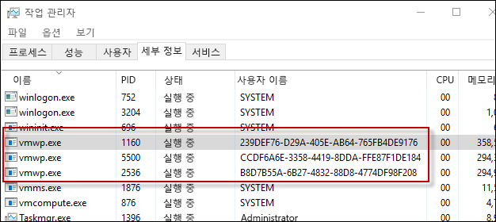

# Hyper-V 컨테이너

**이 예비 콘텐츠는 변경될 수 있습니다.**

Windows 컨테이너 기술은 Windows Server 컨테이너와 Hyper-V 컨테이너 등, 두 가지 다른 유형의 컨테이너를 포함합니다. 두 컨테이너 유형 모두 생성, 관리, 작동은 동일합니다. 차이점은 컨테이너, 호스트 운영 체제 및 해당 호스트에서 실행되는 모든 다른 컨테이너 간에 만들어지는 격리의 수준입니다.

**Windows Server 컨테이너** – 네임스페이스와 프로세스 격리 기술을 통해 제공되는 격리를 통해 호스트에서 여러 컨테이너가 실행됩니다.

**Hyper-V 컨테이너** – 여러 컨테이너가 한 호스트에서 실행되지만 각 컨테이너는 유틸리티 가상 컴퓨터 안에서 실행됩니다. 이로 인해 Hyper-V 컨테이너, 컨테이너 호스트, 기타 컨테이너 호스트에서 실행되는 컨테이너 간에 커널 수준의 격리가 가능합니다.

## Hyper-V 컨테이너 PowerShell

### 컨테이너 만들기

Hyper-V 컨테이너는 Hyper-V 컨테이너임을 나타내는 런타임 매개 변수를 제외하고는 Windows Server 컨테이너와 동일하게 만들어집니다.

PowerShell을 통한 Hyper-V 컨테이너 만들기 예제

```powershell
PS C:\> $con = New-Container -Name HYPVCON -ContainerImageName NanoServer -SwitchName "Virtual Switch" -RuntimeType HyperV
```

### 컨테이너 변환

빌드 시점에 컨테이너를 Hyper-V 컨테이너로 만드는 것 외에도, PowerShell을 통해 만든 Windows Server 컨테이너를 Hyper-V 컨테이너로 변환할 수도 있습니다.

> 현재 컨테이너 런타임 변환을 지원하는 유일한 운영 체제는 Nano Server입니다.

기본 런타임으로 새 컨테이너를 만듭니다.

```powershell
PS C:\> New-Container -Name DEMO -ContainerImageName nanoserver -SwitchName NAT
```
컨테이너에서 런타임 속성을 반환합니다. 런타임이 기본값으로 설정되었는지 확인합니다.

```powershell
PS C:\> Get-Container | Select ContainerName, RuntimeType

ContainerName RuntimeType
------------- -----------
DEMO              Default
```

`set-container` 명령을 사용하여 컨테이너 런타임을 변경합니다.

```powershell
PS C:\> Set-Container $con -RuntimeType HyperV
```

마지막으로 런타임 속성을 다시 반환하여 변경을 확인합니다.

```powershell
PS C:\> Get-Container | select ContainerName, RuntimeType

ContainerName RuntimeType
------------- -----------
DEMO               HyperV
```

## Hyper-V 컨테이너 Docker

### 컨테이너 만들기

Docker로 Hyper-V 컨테이너를 관리하는 것은 Windows Server 컨테이너와 거의 동일합니다. Docker로 Hyper-V 컨테이너를 만들 때 `–issolation=hyperv` 매개 변수를 사용합니다.

```powershell
docker run -it --isolation=hyperv 646d6317b02f cmd
```

## 내부 구조

### VM 작업자 프로세스

만들어진 각 Hyper-V 컨테이너에 대해 해당하는 가상 컴퓨터 작업자 프로세스가 생성됩니다.

```powershell
PS C:\> Get-Container | Select Name, RuntimeType, ContainerID | Where {$_.RuntimeType -eq 'Hyperv'}

Name RuntimeType ContainerId
---- ----------- -----------
TST3      HyperV 239def76-d29a-405e-ab64-765fb4de9176
TST       HyperV b8d7b55a-6b27-4832-88d8-4774df98f208
TST2      HyperV ccdf6a6e-3358-4419-8dda-ffe87f1de184
```

컨테이너 ID와 프로세스 사용자 이름을 통해 컨테이너를 프로세스와 일치시킬 수 있습니다.



이 관계는 `Get-ComputeProcess` 명령으로도 확인할 수 있습니다.

```powershell
PS C:\> Get-ComputeProcess

Id                                   Name Owner      Type
--                                   ---- -----      ----
239DEF76-D29A-405E-AB64-765FB4DE9176 TST3 VMMS  Container
B8D7B55A-6B27-4832-88D8-4774DF98F208 TST  VMMS  Container
CCDF6A6E-3358-4419-8DDA-FFE87F1DE184 TST2 VMMS  Container
```

`Get-ComputeProcess` 명령에 대한 자세한 내용은 [관리 상호 운용성](./hcs_powershell.md)에서 확인하세요.

## 격리 데모

### Windows Server 컨테이너

다음 연습은 Hyper-V 컨테이너의 격리를 보여주기 위해 사용할 수 있습니다. 이 연습에서는 Windows Server와 Hyper-V 컨테이너를 모두 만듭니다. 컨테이너 호스트에서 실행 중인 프로세스를 살펴봄으로써 Windows Server 컨테이너 프로세스를 컨테이너 호스트에서 공유하는 방식을 확인할 수 있지만 Hyper-V 컨테이너 프로세스는 아닙니다.

```powershell
PS C:\> get-process | where {$_.ProcessName -eq 'csrss'}

Handles  NPM(K)    PM(K)      WS(K) VM(M)   CPU(s)     Id  SI ProcessName
-------  ------    -----      ----- -----   ------     --  -- -----------
    255      12     1820       4000 ...98     0.53    532   0 csrss
    116      11     1284       3700 ...94     0.25    608   1 csrss
    246      13     1844       5504 ...17     3.45   3484   2 csrss
```

새 Windows Server 컨테이너 만들기

```powershell
PS C:\> New-Container -Name WINCONT -ContainerImageName WindowsServerCore -SwitchName "Virtual Switch"
```

컨테이너를 시작합니다.

```powershell
PS C:\> Start-Container $con
```

컨테이너와 원격 PS 세션을 만듭니다.

```powershell
PS C:\> Enter-PSSession -ContainerId $con.ContainerId –RunAsAdministrator
```

원격 컨테이너 세션에서 프로세스 이름이 csrss인 모든 프로세스를 반환합니다. 실행 중인 csrss 프로세스에 대한 프로세스 ID를 기록해 둡니다(아래 예에서는 1228).

```powershell
[WINCONT]: PS C:\> get-process | where {$_.ProcessName -eq 'csrss'}

Handles  NPM(K)    PM(K)      WS(K) VM(M)   CPU(s)     Id  SI ProcessName
-------  ------    -----      ----- -----   ------     --  -- -----------
    167       9     1276       3720 ...97     0.20   1228   3 csrss
```

이제 컨테이너 호스트로부터 csrss 프로세스 목록을 반환합니다. 동일한 csrss 프로세스가 컨테이너 호스트에서도 반환됩니다.

```powershell
PS C:\> get-process | where {$_.ProcessName -eq 'csrss'}

Handles  NPM(K)    PM(K)      WS(K) VM(M)   CPU(s)     Id  SI ProcessName
-------  ------    -----      ----- -----   ------     --  -- -----------
    252      11     1712       3968 ...98     0.53    532   0 csrss
    113      11     1176       3676 ...93     0.25    608   1 csrss
    175       9     1260       3708 ...97     0.20   1228   3 csrss
    243      13     1736       5512 ...17     3.77   3484   2 csrss
```
### Hyper-V 컨테이너

컨테이너 호스트에서 csrss 프로세스 목록을 반환합니다.

```powershell
PS C:\> get-process | where {$_.ProcessName -eq 'csrss'}

Handles  NPM(K)    PM(K)      WS(K) VM(M)   CPU(s)     Id  SI ProcessName
-------  ------    -----      ----- -----   ------     --  -- -----------
    261      12     1820       4004 ...98     0.53    532   0 csrss
    116      11     1284       3704 ...94     0.25    608   1 csrss
    246      13     1844       5536 ...17     3.83   3484   2 csrss
```

이제 Hyper-V 컨테이너를 만듭니다.

```powershell
PS C:\> $con = New-Container -Name HYPVCON -ContainerImageName NanoServer -SwitchName "Virtual Switch" -RuntimeType HyperV
```

Hyper-V 컨테이너 시작

```powershell
PS C:\> Start-Container $con
```

Hyper-V 컨테이너와의 원격 PS 세션을 만듭니다.

```powershell
PS C:\> Enter-PSSession -ContainerId $con.ContainerId –RunAsAdministrator
```

Hyper-v 컨테이너 내에서 실행되는 csrss 프로세스의 목록을 반환합니다. csrss 프로세스의 프로세스 ID를 기록해 둡니다(아래 예에서는 956).

```powershell
[HYPVCON]: PS C:\> get-process | where {$_.ProcessName -eq 'csrss'}

Handles  NPM(K)    PM(K)      WS(K) VM(M)   CPU(s)     Id  SI ProcessName
-------  ------    -----      ----- -----   ------     --  -- -----------
              4      452       1520 ...63     0.06    956   1 csrss
```

이제 컨테이너 호스트에서 csrss 프로세스 목록을 반환합니다. csrss 프로세스를 컨테이너 내부와 컨테이너 호스트 모두에서 볼 수 있었던 Windows Server 컨테이너와는 달리, Hyper-V 컨테이너 프로세스는 컨테이너 자체 안에서만 볼 수 있습니다. Hyper-V 컨테이너는 유틸리티 가상 컴퓨터에서 캡슐화되며 프로세스는 해당 가상 컴퓨터에 대해서만 격리되기 때문입니다.

```powershell
PS C:\> get-process | where {$_.ProcessName -eq 'csrss'}

Handles  NPM(K)    PM(K)      WS(K) VM(M)   CPU(s)     Id  SI ProcessName
-------  ------    -----      ----- -----   ------     --  -- -----------
    255      12     1716       3972 ...98     0.56    532   0 csrss
    113      11     1176       3676 ...93     0.25    608   1 csrss
    243      13     1732       5512 ...18     4.23   3484   2 csrss
```


