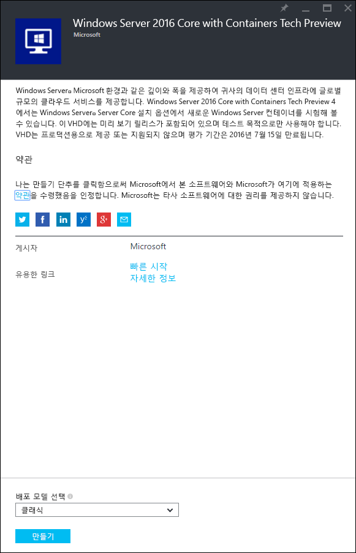
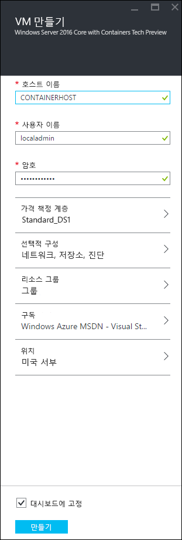
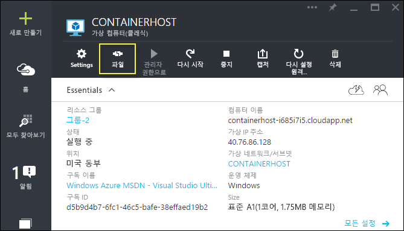
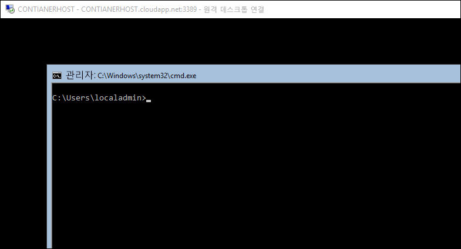

# Azure 빠른 시작

Azure에서 Windows Server 컨테이너를 만들어 관리하려면 먼저 Windows Server 컨테이너 기능이 미리 구성되어 있는 Windows Server 2016 Technical Preview 이미지를 배포해야 합니다. 이 가이드에서는 이 과정을 안내합니다.

> Microsoft Azure는 Hyper-V 컨테이너를 지원하지 않습니다. Hyper-V 컨테이너 연습을 완료하려면 온-프레미스 컨테이너 호스트가 필요합니다.

## Azure 포털 사용 시작

Azure 계정이 있으면 바로 [컨테이너 호스트 VM 만들기](#CreateacontainerhostVM)로 건너뜁니다.

1. [azure.com](https://azure.com)에서 [Azure 무료 평가판](https://azure.microsoft.com/en-us/pricing/free-trial/)에 해당하는 절차에 따릅니다.
2. Microsoft 계정으로 로그인합니다.
3. 계정의 준비가 되면 [Azure 관리 포털](https://portal.azure.com)에 로그인합니다.

## 컨테이너 호스트 VM 만들기

Azure Market Place에서 '컨테이너'를 검색하면 ‘Windows Server 2016 Core with Containers Tech Preview 4’가 반환됩니다.

이미지를 선택하고 `만들기`를 클릭합니다.

가상 컴퓨터 이름을 지정하고 사용자 이름과 암호를 선택합니다.

선택적 구성 > 끝점을 선택하고 아래에서처럼 개인 및 공용 포트 80으로 HTTP 끝점을 입력합니다. 완료되면 확인을 두 번 클릭합니다.

`만들기` 단추를 선택하여 가상 컴퓨터 배포 프로세스를 시작합니다.

VM 배포가 완료되면 연결 버튼을 선택하여 Windows Server 컨테이너 호스트로 RDP 세션을 시작합니다.

VM 만들기 마법사를 통해 지정한 사용자 이름과 암호를 사용하여 VM에 로그인합니다. 로그인한 후에는 Windows 명령 프롬프트가 표시됩니다.

## 비디오 연습

<iframe src="https://channel9.msdn.com/Blogs/containers/Quick-Start-Configure-Windows-Server-Containers-in-Microsoft-Azure/player#ccLang=ko" width="800" height="450"  allowFullScreen="true" frameBorder="0" scrolling="no"></iframe>

## 다음 단계: 컨테이너 사용 시작

이제 Windows 컨테이너 기능을 실행하는 Windows Server 2016 시스템이 준비되었으므로 다음 가이드로 이동하여 Windows Server 컨테이너와 Windows Server 컨테이너 이미지 작업을 시작합니다.

[빠른 시작: Windows 컨테이너 및 Docker](./manage_docker.md)  
[빠른 시작: Windows 컨테이너 및 PowerShell](./manage_powershell.md)

