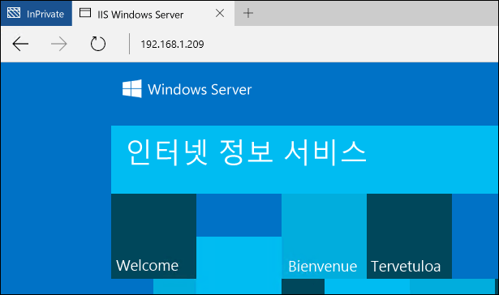
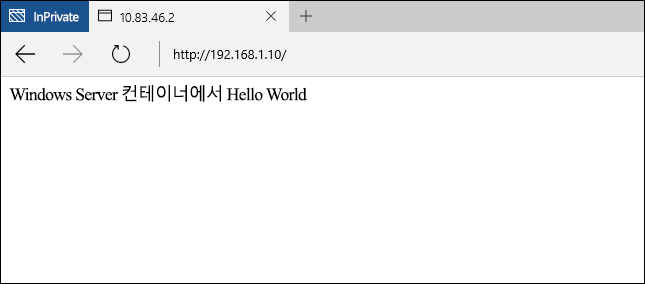
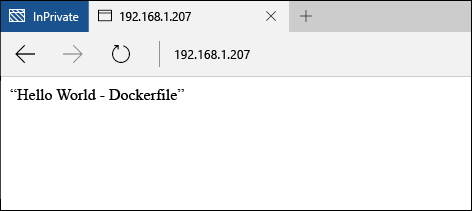

# Windows 컨테이너 빠른 시작 - Docker

Windows 컨테이너는 단일 컴퓨터 시스템에서 격리된 여러 응용 프로그램을 신속하게 배포하는 데 사용할 수 있습니다. 이 연습에서는 Docker를 사용한 Windows 컨테이너 만들기 및 관리를 보여 줍니다. 마치고 나면 Docker가 Windows 컨테이너에 통합되는 방식에 대한 기본 내용을 이해하고, 기술과 관련한 실질적인 경험을 얻게 됩니다.

이 연습에서는 Windows Server 컨테이너와 Hyper-V 컨테이너를 모두 자세히 설명합니다. 각 컨테이너 형식에는 자체 기본 요구 사항이 있습니다. 컨테이너 호스트를 신속하게 배포하는 절차는 Windows 컨테이너 설명서에 포함되어 있습니다. 이것이 Windows 컨테이너를 신속하게 시작하는 가장 쉬운 방법입니다. 컨테이너 호스트가 아직 없는 경우 [컨테이너 호스트 배포 빠른 시작](./container_setup.md)을 참조하세요.

각 연습마다 다음 항목이 필요합니다.

**Windows Server 컨테이너:**

- 온-프레미스 또는 Azure에서 Windows Server 2016(Full 또는 Core)를 실행하는 Windows 컨테이너 호스트입니다.

**Hyper-V 컨테이너:**

- 중첩된 가상화를 사용하는 Windows 컨테이너 호스트입니다.
- Windows Server 2016 미디어 - [다운로드](https://aka.ms/tp4/serveriso)

> Microsoft Azure는 Hyper-V 컨테이너를 지원하지 않습니다. Hyper-V 컨테이너 연습을 완료하려면 온-프레미스 컨테이너 호스트가 필요합니다.

## Windows Server 컨테이너

Windows Server 컨테이너는 실행 중인 응용 프로그램 및 호스팅 프로세스에 대한 격리된 휴대용, 리소스 제어된 운영 환경을 제공합니다. Windows Server 컨테이너는 프로세스와 네임스페이스 격리를 통해 컨테이너와 호스트 간의 격리를 제공합니다.

### 컨테이너 만들기

컨테이너를 만들기 전에 `docker images` 명령을 사용하여 호스트에 설치된 컨테이너 이미지를 나열합니다.

```powershell
PS C:\> docker images

REPOSITORY          TAG                 IMAGE ID            CREATED             VIRTUAL SIZE
windowsservercore   10.0.10586.0        6801d964fda5        2 weeks ago         0 B
windowsservercore   latest              6801d964fda5        2 weeks ago         0 B
nanoserver          10.0.10586.0        8572198a60f1        2 weeks ago         0 B
nanoserver          latest              8572198a60f1        2 weeks ago         0 B
```

이 예에서는 Windows Server Core 이미지를 사용하여 컨테이너를 만듭니다. 이 작업은 `docker run 명령`으로 수행합니다. `docker 실행`에 대한 자세한 내용은 [docker.com의 Docker Run 참조](https://docs.docker.com/engine/reference/run/)에서 참조하세요.

이 예제에서는 이름이 `iisbase`인 컨테이너를 만들고 이 컨테이너와의 대화형 세션을 시작합니다.

```powershell
C:\> docker run --name iisbase -it windowsservercore cmd
```

컨테이너를 만들면 컨테이너 안의 shell 세션에서 작업합니다.


### IIS 이미지 만들기

IIS를 설치하고 그 다음 컨테이너에서 만든 이미지를 설치합니다. IIS를 설치하려면 다음을 실행합니다.

```powershell
C:\> powershell.exe Install-WindowsFeature web-server
```

완료되면 대화형 셸 세션을 종료합니다.

```powershell
C:\> exit
```

마지막으로 `docker commit`을 사용하여 새 컨테이너 이미지에 컨테이너가 커밋됩니다. 이 예제에서는 이름이 `windowsservercoreiis`인 새 컨테이너 이미지를 만듭니다.

```powershell
C:\> docker commit iisbase windowsservercoreiis
4193c9f34e320c4e2c52ec52550df225b2243927ed21f014fbfff3f29474b090
```

새 IIS 이미지는 `docker images` 명령을 사용하여 볼 수 있습니다.

```powershell
C:\> docker images

REPOSITORY             TAG                 IMAGE ID            CREATED             VIRTUAL SIZE
windowsservercoreiis   latest              4193c9f34e32        4 minutes ago       170.8 MB
windowsservercore      10.0.10586.0        6801d964fda5        2 weeks ago         0 B
windowsservercore      latest              6801d964fda5        2 weeks ago         0 B
nanoserver             10.0.10586.0        8572198a60f1        2 weeks ago         0 B
nanoserver             latest              8572198a60f1        2 weeks ago         0 B
```

### 네트워크 구성

Docker를 통해 컨테이너를 만들기 전에 컨테이너에 대한 네트워크 연결을 허용하는 Windows 방화벽 규칙을 만들어야 합니다. 다음을 실행하여 포트 80에 대한 규칙을 만듭니다.

```powershell
if (!(Get-NetFirewallRule | where {$_.Name -eq "TCP80"})) {
    New-NetFirewallRule -Name "TCP80" -DisplayName "HTTP on TCP/80" -Protocol tcp -LocalPort 80 -Action Allow -Enabled True
}
```

컨테이너 호스트 IP 주소를 확인하려 할 수도 있습니다. 해당 내용을 이 연습 전체에서 사용하게 됩니다.

### IIS 컨테이너 만들기

이제 IIS를 지원하는 운영 환경을 배포하는 데 사용할 수 있는 IIS가 들어 있는 컨테이너 이미지가 준비되었습니다.

새 이미지에서 컨테이너를 만들려면 `docker run` 명령을 사용하고 이번에는 IIS 이미지의 이름을 지정합니다. 이 샘플에서는 `-p 80:80` 매개 변수를 지정했습니다. 컨테이너가 NAT(Network Address Translation)를 통해 IP 주소를 공급하는 가상 스위치에 연결되어 있으므로, 컨테이너 호스트의 포트를 컨테이너 NAT IP 주소의 포트에 매핑해야 합니다. `-p`에 대한 자세한 내용은 [docker.com의 Docker Run 참조](https://docs.docker.com/engine/reference/run/)에서 참조하세요.

```powershell
C:\> docker run --name iisdemo -it -p 80:80 windowsservercoreiis cmd
```

컨테이너를 만든 후 브라우저를 열고 컨테이너 호스트의 IP 주소를 검색합니다. 호스트의 포트 80이 컨테이너의 포트 80에 매핑되지 않았으므로 IIS 시작 화면이 표시되어야 합니다.



### 응용 프로그램 만들기

다음 명령을 실행하여 IIS 시작 화면을 제거합니다.

```powershell
C:\> del C:\inetpub\wwwroot\iisstart.htm
```

다음 명령을 실행하여 기본 IIS 사이트를 새 정적 사이트로 바꿉니다.

```powershell
C:\> echo "Hello World From a Windows Server Container" > C:\inetpub\wwwroot\index.html
```

컨테이너 호스트의 IP 주소를 다시 검색하면 'Hello World' 응용 프로그램이 표시됩니다. 업데이트된 응용 프로그램을 확인하기 위해 모든 기존 브라우저 연결을 닫거나 브라우저 캐시의 선택을 취소해야 할 수 있습니다.



컨테이너와의 대화형 세션을 종료합니다.

```powershell
C:\> exit
```

컨테이너 제거

```powershell
C:\> docker rm iisdemo
```
IIS 이미지를 제거합니다.

```powershell
C:\> docker rmi windowsservercoreiis
```

## Dockerfile

마지막 연습에서 컨테이너를 수동으로 만들어 수정한 다음 새 컨테이너 이미지에 캡처했습니다. Docker에는 이 프로세스를 자동화하기 위한 방법이 포함되어 있습니다. 이를 dockerfile이라고 합니다. 이 연습은 마지막 연습과 결과는 동일하지만 프로세스가 완전히 자동화되어 있습니다.

### IIS 이미지 만들기

컨테이너 호스트에서 `c:\build` 디렉터리를 만들고, 이 디렉터리에서 이름이 `dockerfile`인 파일을 만듭니다.

```powershell
C:\> powershell new-item c:\build\dockerfile -Force
```

메모장에서 dockerfile을 엽니다.

```powershell
C:\> notepad c:\build\dockerfile
```

dockerfile에 다음 텍스트를 복사하 고 파일을 저장합니다. 이 명령은 Docker가 `windosservercore`를 기초로 새 이미지를 만들고 `실행`을 통해 지정한 수정 내용을 포함하도록 지시합니다. Dockerfile에 대한 자세한 내용은 [docker.com의 Dockerfile 참조](http://docs.docker.com/engine/reference/builder/)에서 참조하세요.

```powershell
FROM windowsservercore
RUN dism /online /enable-feature /all /featurename:iis-webserver /NoRestart
RUN echo "Hello World - Dockerfile" > c:\inetpub\wwwroot\index.html
```

이 명령은 자동화된 이미지 빌드 프로세스를 시작합니다.  `-t` 매개 변수는 프로세스가 새 이미지의 이름을 `iis`로 지정하도록 지시합니다.

```powershell
C:\> docker build -t iis c:\Build
```

완료되면 `docker images` 명령을 사용하여 만들어진 이미지를 확인할 수 있습니다.

```powershell
C:\> docker images

REPOSITORY          TAG                 IMAGE ID            CREATED             VIRTUAL SIZE
iis                 latest              abb93867b6f4        26 seconds ago      209 MB
windowsservercore   10.0.10586.0        6801d964fda5        2 weeks ago         0 B
windowsservercore   latest              6801d964fda5        2 weeks ago         0 B
nanoserver          10.0.10586.0        8572198a60f1        2 weeks ago         0 B
nanoserver          latest              8572198a60f1        2 weeks ago         0 B
```

### IIS 컨테이너 배포

이제 마지막 연습에서처럼 컨테이너를 배포하고 호스트의 포트 80을 컨테이너의 포트 80에 배포합니다.

```powershell
C:\> docker run --name iisdemo -it -p 80:80 iis cmd
```

컨테이너를 만든 후 컨테이너 호스트의 IP 주소로 이동합니다. hello world 응용 프로그램에 표시됩니다.



컨테이너와의 대화형 세션을 종료합니다.

```powershell
C:\> exit
```

컨테이너 제거

```powershell
C:\> docker rm iisdemo
```
IIS 이미지를 제거합니다.

```powershell
C:\> docker rmi iis
```

## Hyper-V 컨테이너

Hyper-V 컨테이너는 Windows Server 컨테이너에 대한 추가 수준의 격리를 제공합니다. 각 Hyper-V 컨테이너는 고도로 최적화된 가상 컴퓨터 내에서 만들어집니다. Windows Server 컨테이너가 컨테이너 호스트와 커널을 공유하는 것과 달리 Hyper-V 컨테이너는 완전히 격리됩니다. Hyper-V 컨테이너는 Windows Server 컨테이너와 동일하게 만들어지고 관리됩니다. Hyper-V 컨테이너에 대한 자세한 내용은 [Hyper-V 컨테이너 관리](../management/hyperv_container.md)를 참조하세요.

> Microsoft Azure는 Hyper-V 컨테이너를 지원하지 않습니다. Hyper-V 연습을 완료하려면 온-프레미스 컨테이너 호스트가 필요합니다.

### 컨테이너 만들기

컨테이너는 Nano Server OS 이미지를 실행하기 때문에 IIS를 설치하려면 Nano Server IIS 패키지가 필요합니다. 이는 `NanoServer\Packages` 디렉터리 아래의 Windows Sever 2016 TP4 설치 미디어에서 찾을 수 있습니다.

이 예제에서는 `docker 실행`의 `-v`의 매개 변수를 사용하여 실행 중인 컨테이너가 컨테이너 호스트의 디렉터리를 사용할 수 있게 됩니다. 그 전에 원본 디렉터리 구성해야 합니다.

컨테이너와 공유할 컨테이너 호스트에 디렉터리를 만듭니다. 이미 PowerShell 연습을 마쳤으면 이 디렉터리와 필요한 파일이 있을 수도 있습니다.

```powershell
C:\> powershell New-Item -Type Directory c:\share\en-us
```

`NanoServer\Packages`에서 `Microsoft-NanoServer-IIS-Package.cab`을 컨테이너 호스트의 `c:\share`로 복사합니다.

`NanoServer\Packages\en-us\Microsoft-NanoServer-IIS-Package.cab`을 컨테이너 호스트의 `c:\share\en-us`로 복사합니다.

c:\share 폴더에 unattend.xml이라는 파일을 만들고 이 텍스트를 unattend.xml 파일로 복사합니다.

```powershell
<?xml version="1.0" encoding="utf-8"?>
<unattend xmlns="urn:schemas-microsoft-com:unattend">
    <servicing>
        <package action="install">
            <assemblyIdentity name="Microsoft-NanoServer-IIS-Package" version="10.0.10586.0" processorArchitecture="amd64" publicKeyToken="31bf3856ad364e35" language="neutral" />
            <source location="c:\iisinstall\Microsoft-NanoServer-IIS-Package.cab" />
        </package>
        <package action="install">
            <assemblyIdentity name="Microsoft-NanoServer-IIS-Package" version="10.0.10586.0" processorArchitecture="amd64" publicKeyToken="31bf3856ad364e35" language="en-US" />
            <source location="c:\iisinstall\en-us\Microsoft-NanoServer-IIS-Package.cab" />
        </package>
    </servicing>
</unattend>
```

완료되면 컨테이너 호스트의 `c:\share` 디렉터리는 다음과 같이 구성되어야 합니다.

```
c:\share
|-- en-us
|    |-- Microsoft-NanoServer-IIS-Package.cab
|
|-- Microsoft-NanoServer-IIS-Package.cab
|-- unattend.xml
```

docker가 포함된 Hyper-V 컨테이너를 만들려면 `--isolation=hyperv` 매개 변수를 지정합니다. 이 예제에서는 호스트의 `c:\share` 디렉터리를 컨테이너의 `c:\iisinstall` 디렉터리에 마운트한 다음 컨테이너와의 대화형 셸 세션을 만듭니다.

```powershell
C:\> docker run --name iisnanobase -it -v c:\share:c:\iisinstall --isolation=hyperv nanoserver cmd
```

### IIS 이미지 만들기

컨테이너 셸 세션 안에서 `dism`을 사용하여 IIS를 설치할 수 있습니다. 다음 명령을 실행하여 컨테이너에서 IIS를 설치합니다.

```powershell
C:\> dism /online /apply-unattend:c:\iisinstall\unattend.xml
```

IIS 설치가 완료되면 다음 명령을 사용하여 수동으로 IIS를 시작합니다.

```powershell
C:\> Net start w3svc
```

컨테이너 세션을 종료합니다.

```powershell
C:\> exit
```

### IIS 컨테이너 만들기

이제 수정된 Nano Server 컨테이너를 새 컨테이너 이미지에 커밋할 수 있습니다. 이를 위해 `docker commit` 명령을 사용합니다.

```powershell
C:\> docker commit iisnanobase nanoserveriis
```

컨테이너 이미지 목록이 반환되면 결과를 확인할 수 있습니다.

```powershell
C:\> docker images

REPOSITORY          TAG                 IMAGE ID            CREATED              VIRTUAL SIZE
nanoserveriis       latest              444435a4e30f        About a minute ago   69.14 MB
windowsservercore   10.0.10586.0        6801d964fda5        2 weeks ago          0 B
windowsservercore   latest              6801d964fda5        2 weeks ago          0 B
nanoserver          10.0.10586.0        8572198a60f1        2 weeks ago          0 B
nanoserver          latest              8572198a60f1        2 weeks ago          0 B
```

### 응용 프로그램 만들기

이제 Nano Server IIS 이미지를 새 컨테이너에 배포할 수 있습니다.

```powershell
C:\> docker run -it -p 80:80 --isolation=hyperv nanoserveriis cmd
```

다음 명령을 실행하여 IIS 시작 화면을 제거합니다.

```powershell
C:\> del C:\inetpub\wwwroot\iisstart.htm
```

다음 명령을 실행하여 기본 IIS 사이트를 새 정적 사이트로 바꿉니다.

```powershell
C:\> echo "Hello World From a Hyper-V Container" > C:\inetpub\wwwroot\index.html
```

컨테이너 호스트의 IP 주소로 이동하면 'Hello World' 응용 프로그램이 표시됩니다. 업데이트된 응용 프로그램을 확인하기 위해 모든 기존 브라우저 연결을 닫거나 브라우저 캐시의 선택을 취소해야 할 수 있습니다.


컨테이너와의 대화형 세션을 종료합니다.

```powershell
C:\> exit
```


